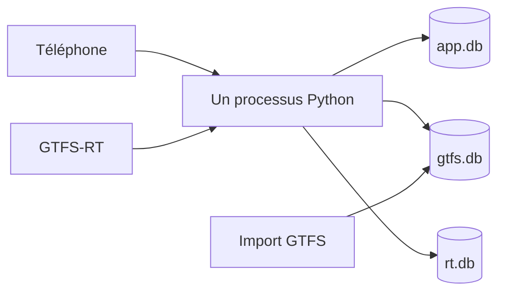

# ComptageFer

Outil collaboratif pour compter la fréquentation des TER en France, puis rendre ces comptages publics, lisibles et réutilisables.

**Statut :** cadrage, septembre 2026. Pas encore de code applicatif.

**Source du besoin :** cahier des charges « ComptagesFer » (présentation de trois diapositives).

**Dépôt :** https://github.com/LordD9/ComptageFer — licence du code : GPL-3.0.

**Décision d'architecture :** un seul processus Python, deux fichiers SQLite, pages statiques servies par ce processus. Aucun service managé. Le déploiement, c'est un conteneur : `docker compose up`, un volume pour les bases. Pas de second mode d'installation.

---

## 1. Le problème

Les données officielles de fréquentation des trains régionaux sont souvent confidentielles, hétérogènes, ou trop pauvres pour comparer des lignes. Beaucoup d'études en ont pourtant besoin : potentiel d'une ligne, offre à mettre en face, comparaison entre territoires.

L'idée est simple. Des gens déjà dans le train — passionnés, associations d'usagers, voyageurs, agents — comptent les voyageurs pendant leur trajet et le saisissent dans un outil léger. En retour, l'outil montre ce qui a été collecté. D'abord brut. Agrégé seulement quand la matière est suffisante, et seulement avec une méthode visible.

Le périmètre visé à terme : toutes les lignes TER de France, autocars compris quand l'offre théorique existe.

Ce dépôt est un projet personnel. Il ne porte pas la marque d'un établissement public.

## 2. Ce que l'outil doit permettre

### Contribuer

Le cas d'usage est un téléphone, dans un train, souvent avec un réseau médiocre. La saisie part d'une origine et d'une destination. La carte vient après, pour lire les résultats.

1. J'ouvre l'application. Si je l'autorise, la position propose la gare la plus proche, puis elle est oubliée. Sinon je cherche mon origine.
2. Je donne ma destination.
3. L'outil liste les circulations qui desservent cette origine-destination, sur une plage de 4 heures centrée sur maintenant : les deux heures passées, les deux heures à venir. L'heure et l'état viennent du flux temps réel, pas de l'horaire théorique. Je sélectionne mon train. S'il n'y est pas, je signale une offre manquante. Je ne l'invente pas dans le référentiel.
4. Je passe au formulaire. Le retard, l'heure et la suppression ne se tapent pas.
   - **Comptage unique.** Une interstation (les deux arrêts qui l'encadrent), un effectif, et trois indicateurs approximatifs : part de gens debout, part de places assises restantes, écart de charge entre la partie la plus chargée et la moins chargée.
   - **Serpent de charge.** Je monte, je compte une fois les portes fermées, puis à chaque arrêt j'indique montées et descentes jusqu'à ma descente. Les indicateurs du mode unique sont optionnels sur chaque interstation. Compter sa propre descente est optionnel.
5. Pseudo, si je veux. Facultatif. Pas un compte.
6. En quittant, j'indique un pourcentage de fiabilité. Commentaire et modèle de véhicule seulement si j'ai quelque chose à ajouter.

À la sélection, l'outil fige l'état du train choisi, du précédent et du suivant sur la même origine-destination. C'est cette photo qui voyage avec le comptage. On ne relit pas le flux plus tard pour reconstituer le contexte : il ne le contient plus.

### Lire

1. Une carte, ou une recherche par nom de gare, origine, destination ou nom de ligne.
2. S'il n'y a rien : une invitation à compter, pas une page vide.
3. S'il y a peu de comptages : la liste, le type (unique ou serpent), les commentaires. Pas d'estimation déguisée en chiffre officiel.
4. S'il y en a assez : des estimations en voyageurs et en voyageurs.kilomètres à l'année, avec un découpage semaine / week-end, creux / pointe. Cette marche n'est pas la première. Elle exige une méthode écrite, parce qu'un échantillon de passionnés n'est pas un sondage.
5. Plus tard : comparer des lignes, agréger un lot de lignes, une agglomération ou une région, exporter des synthèses.

L'export des données brutes, lui, arrive tôt. C'est le retour dû aux gens qui comptent.

## 3. Principes

- **Simple à poser.** Un conteneur, une base fichier, pas de base managée. La commande est la même partout où Docker tourne.
- **Le téléphone dans le train est le client principal.** Grandes zones tactiles, peu d'étapes. On saisit le compte, pas le contexte que le flux connaît déjà.
- **Brut avant estimé.** Pas de chiffre annuel tant que la règle d'extrapolation n'est pas écrite et affichée à côté du chiffre. Une suppression du train précédent est un fait conservé, pas un effectif qu'on réécrit.
- **Anonyme par défaut.** Pas de compte pour contribuer. Un pseudo facultatif peut signer un comptage. Il n'identifie personne, et il n'ouvre aucun droit.
- **L'offre vient du GTFS, le contexte du temps réel, les comptages des gens.** On ne mélange pas les trois. Une circulation absente est un signalement, pas une ligne créée à la main.
- **Pas de trace GPS.** La position peut proposer l'arrêt le plus proche. Elle n'est pas enregistrée.
- **Les comptages partagés sont en Licence Ouverte 2.0.** Le code reste en GPL-3.0. Les deux licences ne se mélangent pas.
- **Pas de marque institutionnelle**, pour le moment. Le dépôt est personnel.
- **Un effectif saisi n'est pas une fréquentation officielle.** Chaque écran de résultat le dit.

## 4. Architecture



`app.db` garde les comptages et la photo du contexte au moment de la saisie. `stops.db` garde les noms de gares, pas l'horaire. `rt.db` garde quelques heures de temps réel, jetable aussi.

Rien d'autre. Pas de Postgres, pas de Redis, pas de file de messages, pas de frontend à builder sur le serveur.

### Pourquoi ce choix

La contrainte est de déployer la même chose quel que soit l'hébergeur. Donc un artefact, pas une procédure par machine.

Le déploiement est Docker Compose. Une commande, un conteneur, un volume `data/`. Ça ne complique pas : c'est ce qui évite de documenter un virtualenv, une unité systemd et un PaaS en parallèle. Trois notices, c'est trois façons de se tromper. Une seule, testée, suffit.

Docker compliquerait les choses s'il embarquait une base à part, un Redis, un worker. Ici il n'embarque que le processus. SQLite est un fichier dans le volume. Oublier le volume est le seul piège, et le `compose.yaml` le monte par défaut.

L'hôte doit savoir lancer un conteneur. VPS, Raspberry Pi, Coolify, NAS, PaaS conteneur : même commande. Un mutualisé sans Docker n'est pas une cible. Un import GTFS et une carte n'y tiendraient pas de toute façon.

| Option écartée | Raison |
| --- | --- |
| Next.js + Postgres managé (Vercel, Supabase, Firebase) | Deux runtimes, base à part, lié à un hébergeur. |
| Docker + Postgres | Un second conteneur pour une charge qui tient dans un fichier. |
| Microservices | Pas assez de charge, pas assez d'équipes. |
| Application native | Un store de plus, deux codebases. Le web mobile suffit. |
| PHP + SQLite | Très portable sur mutualisé, mais le GTFS et les calculs seront en Python. Inutile de couper en deux. |
| PocketBase seul | Pratique pour du CRUD, gênant dès que le rapprochement GTFS devient le cœur du métier. |
| Notice systemd en plus de Docker | Une seconde procédure qu'on ne testera pas. |

La configuration tient dans l'environnement : chemin des bases, jeton d'admin le moment venu, URL publique. Pas de fichier de config propre à un hébergeur.

SQLite en mode WAL suffit. Les écritures sont rares (un comptage par voyage), les lectures dominent. On migrera le jour où ça ne suffit plus. Ce jour n'est pas le premier.

Un reverse proxy (Caddy, nginx) est optionnel. Il sert au HTTPS. L'application n'en a pas besoin pour fonctionner.

### Pile

- Python 3.12
- FastAPI, servi par uvicorn
- SQLite
- HTML, CSS, un peu de JavaScript. Pas de framework.
- Leaflet et des tuiles OpenStreetMap. Pas de clé d'API.
- Pas de Node en production. Si un bundler devient utile, il reste un outil de développement.

### Offre théorique

Source de la v1 : le GTFS national « Réseau SNCF TGV, Intercités et TER », sur [transport.data.gouv.fr](https://transport.data.gouv.fr/datasets/horaires-sncf).

- Fichier : <https://eu.ftp.opendatasoft.com/sncf/plandata/Export_OpenData_SNCF_GTFS_NewTripId.zip>
- Horaires théoriques SNCF Voyageurs (TER, Intercités, TGV) pour les jours à venir, en GTFS et en NeTEx. On prend le GTFS.
- La version consultée en septembre 2026 fait environ 4,4 Mo, 721 lignes, modes train, car et tramway. Elle n'a pas de `shapes.txt`.

### Temps réel

Le temps réel sert à ne pas faire saisir le contexte. Il ne sert pas à réécrire le comptage.

Sources, sur le même jeu SNCF :

- Trip Updates : <https://proxy.transport.data.gouv.fr/resource/sncf-gtfs-rt-trip-updates>
- Service Alerts : <https://proxy.transport.data.gouv.fr/resource/sncf-gtfs-rt-service-alerts>

Le flux Trip Updates est une photo des trains qui circulent dans les 60 prochaines minutes, rafraîchie toutes les 2 minutes. Il n'a pas d'historique. Un train déjà parti en sort. Une suppression d'il y a deux heures n'y est plus.

La liste vient du cache temps réel, pas de l'horaire théorique. Chaque train du flux porte déjà son heure absolue et ses arrêts. On garde ceux dont le départ tombe dans la fenêtre de 4 heures. Le flux vivant ne couvre que l'heure qui vient : le passé vient du cache, et l'heure au-delà n'apparaît que lorsqu'elle entre dans le flux. Le flux n'a pas le nom des gares. Une table de noms, tirée uniquement de `stops.txt`, sert à la recherche. Ce n'est pas l'horaire.

Le processus interroge le flux toutes les 2 minutes et garde 6 heures dans `rt.db`, puis efface.

À la sélection, on copie trois lignes dans `app.db` : le train choisi, le précédent, le suivant, sur la même origine-destination. Cette copie survit à l'effacement du cache. Si le flux ne sait pas, l'état est `inconnu`. On ne l'invente pas, et le comptage n'est pas bloqué.

Même origine-destination veut dire : le train immédiatement précédent et le train immédiatement suivant qui desservent les deux arrêts du voyageur. C'est l'unité utile pour un report de charge. Si aucun voisin ne dessert les deux arrêts, on prend le voisin sur la même ligne au départ de l'origine, et on le marque comme correspondance faible.

Si Trip Updates est vide, le même cycle essaie le SIRI ET Lite avant de déclarer l'état inconnu. Ce n'est pas un second service. Les deux flux ont la même fenêtre de 60 minutes.

Le poller tourne dans le processus déjà lancé par Compose. Pas de second conteneur.

On ne déduit pas un report de voyageurs d'une suppression. On conserve le fait. L'interprétation viendra avec une méthode, ou pas.

Conséquences :

- La carte v1 relie les arrêts ordonnés. Elle ne suit pas la voie réelle.
- Le GTFS national duplique souvent une gare en arrêt train et arrêt car. Le sélecteur doit montrer le mode.
- Les cars TER opérés par SNCF Voyageurs sont dans ce fichier. Les cars d'autorités régionales (liO, BreizhGo, Aléop, etc.) non. Même commande d'import, autres ZIP, plus tard.
- Certains TER ne sont plus opérés par SNCF Voyageurs. Ils ne sont pas dans ce fichier non plus.

L'import est une commande du même paquet, lancée à la main ou par cron. Ce n'est pas un second service.

```text
python -m comptagefer.gtfs import
```

### Fichiers de déploiement

```text
data/            # volume, hors git
  app.db         # comptages + photo du contexte
  gtfs.db        # offre théorique, jetable
  rt.db          # cache temps réel, quelques heures, jetable
.env             # hors git, contient ADMIN_TOKEN
Dockerfile
compose.yaml     # déclare ADMIN_TOKEN, ne contient pas sa valeur
```

Celui qui lance le conteneur définit `ADMIN_TOKEN` dans `.env`, lu par Compose. Ce jeton est l'administration : masquer une saisie, rien de plus. Il n'est pas dans l'image, ni dans git. Pas de compte administrateur.

## 5. Modèle

Trois fichiers, pour pouvoir jeter l'offre ou le cache sans toucher aux comptages.

### Offre (`gtfs.db`, jetable)

Tables utiles : `stops`, `routes`, `trips`, `stop_times`, `calendar` ou `calendar_dates`.

Index prévus : nom d'arrêt, `(stop_id, heure)`, `route_id`. On garde le mode (train, car, tram).

Les heures GTFS peuvent dépasser 24:00. La date de service n'est pas toujours la date civile. On stocke les deux, on n'invente pas de fuseau : l'offre française est en heure locale.

### Comptages (`app.db`, précieux)

**Session.** Un voyage saisi.

- `id` et `client_id`. Le `client_id` est un UUID créé dans le navigateur avant l'envoi. Il rend l'envoi idempotent : un réessai après un tunnel ne crée pas un doublon. On le pose dès la première saisie, pas à la phase hors-ligne.
- mode : `unique` ou `serpent`
- jeton contributeur anonyme, généré dans le navigateur
- pseudo, facultatif, texte libre court. Pas un compte, pas un droit.
- date de service, heure de départ, heure d'arrivée prévue, copiées de la circulation confirmée, pas tapées
- origine et destination du voyageur, qui ne sont pas forcément celles du train
- circulation confirmée (`trip_id`, `route_id`), sinon rien
- photo du contexte, trois lignes : `precedent`, `courant`, `suivant`
  - départ théorique à l'arrêt d'origine
  - état : `a_l_heure`, `retarde`, `supprime`, `inconnu`
  - retard en minutes, s'il est connu
  - source : `tu`, `alerte`, `siri`, `aucune`
  - instant de la photo
  - correspondance `forte` (les deux arrêts) ou `faible` (même ligne, origine seulement)
- commentaire et modèle de véhicule, optionnels, seuls champs de contexte encore saisis
- fiabilité, entier de 0 à 100
- horodatage de réception

La photo est prise à la confirmation, renvoyée au téléphone, et renvoyée avec le comptage. Un envoi tardif, après un tunnel, ne relit pas le flux : l'état aurait changé, ou disparu.

**Observation.** Une mesure dans la session.

- mode unique : une ligne, l'interstation, l'effectif, les trois indicateurs optionnels
- mode serpent : une suite ordonnée. Effectif portes fermées, puis montées et descentes par arrêt. Indicateurs optionnels par interstation.

Les pourcentages sont des estimations de l'utilisateur. On ne déduit pas l'un de l'autre.

**Signalement d'offre manquante.** Origine, destination, heure, commentaire. Sert à voir les trous du GTFS. Ne crée pas de ligne.

On ne stocke pas de position GPS.

## 6. Hors périmètre pour l'instant

- Comptes, mots de passe, OAuth.
- Estimation annuelle de voyageurs et de voyageurs.kilomètres.
- Comparaison de lignes, agrégats région ou agglomération.
- Géométrie réelle des lignes.
- Archivage permanent de tout le flux national. Seuls le cache court et les photos liées à un comptage sont gardés.
- Application native, et PWA installable.
- Modération multi-utilisateurs. L'administration, c'est `ADMIN_TOKEN` dans l'environnement du conteneur.
- Édition du GTFS depuis l'interface.

## 7. Plan

Chaque phase se termine par quelque chose de déployable. On ne commence pas la suivante tant que la précédente n'est pas utilisable.

Le plan tâche par tâche, avec tests, s'écrit au début de chaque phase. Pas avant : le cadrage bougerait trop.

### Phase 0 — Cadrage

Ce document. Les questions de la section 8 sont tranchées.

### Phase 1 — Squelette qui se déploie

Un processus qui démarre partout, avec une base vide et une page d'accueil.

Fichiers :

- `pyproject.toml`, paquet `comptagefer`
- `comptagefer/app.py` — `GET /` et `GET /health`
- création du schéma `app.db` au démarrage
- `Dockerfile`, `compose.yaml`, volume `./data`
- `.gitignore` pour `data/`, `.env`, `.venv/`
- `compose.yaml` déclare `ADMIN_TOKEN`, la valeur vient du `.env` local
- notice de déploiement dans le README : `docker compose up`, et le jeton d'admin à définir au lancement

Vérification : sur une machine neuve, `docker compose up` répond sur le port annoncé, et `data/app.db` survit à un redémarrage.

### Phase 2 — Import GTFS

Proposer une circulation à partir d'un arrêt et d'une heure.

- commande d'import du ZIP national
- `gtfs.db` en lecture seule côté API
- `GET /api/stops?q=`
- `GET /api/trips?stop_id=&at=` — circulations autour de l'heure, avant et après

Vérification : une grande gare à une heure de pointe renvoie des TER, et distingue train et car quand les deux existent.

### Phase 3 — Saisie : origine, destination, train, compte

Le parcours téléphone. On choisit un train dans une liste, on ne le décrit pas.

- poller dans le même processus : Trip Updates et alertes toutes les 2 minutes, cache 6 heures dans `rt.db`
- repli SIRI ET Lite si Trip Updates est vide
- `GET /api/trips?from=&to=&at=` : circulations du cache temps réel qui desservent les deux arrêts entre `at - 2 h` et `at + 2 h`
- à la sélection, photo du train choisi, du précédent et du suivant
- formulaire : interstation, effectif, indicateurs, fiabilité, pseudo facultatif
- `POST /api/sessions` enregistre le comptage, le pseudo s'il y en a un, et la photo reçue, sans relire le flux
- idempotent sur `client_id`
- signalement d'offre manquante

Vérification : la liste d'une origine-destination couvre bien 4 heures. Un comptage relu après effacement de `rt.db` a encore ses trois circulations et leurs états. Renvoyer le même `client_id` ne crée pas une seconde session. Couper le flux ne bloque pas la saisie.

### Phase 4 — Réseau coupé

Priorité avant la carte. Dans un TER, le réseau lâche. Un comptage perdu ne sert à personne.

- si l'envoi échoue, le payload reste dans le navigateur, photo comprise
- réessai au retour du réseau, même `client_id`
- le choix du train se fait quand le réseau passe. Pas de GTFS hors ligne en v1.

Vérification : mode avion après la sélection, saisie, retour réseau, une seule session créée, avec la photo prise avant le tunnel.

### Phase 5 — Serpent de charge

Le second mode, pas avant que le premier survive à un tunnel.

- saisie arrêt par arrêt, reprise si on quitte la page
- même file d'attente que la phase 4
- reconstruction : effectif suivant = effectif + montées − descentes
- indicateurs de charge optionnels

Vérification : une session de trois arrêts donne un profil cohérent avec cette égalité.

### Phase 6 — Lecture, carte, export

La carte sert à voir les résultats, pas à saisir.

- liste des comptages, pseudo affiché s'il a été donné
- carte Leaflet : arrêts comptés, segments droits entre les arrêts d'une saisie
- recherche par nom
- page ligne : liste brute, ou invitation à contribuer s'il n'y a rien
- `GET /api/export.csv`, licence indiquée : Licence Ouverte 2.0
- mention visible : ce n'est pas une fréquentation officielle

Vérification : le comptage de la phase 3 est sur la carte et dans le CSV.

### Phase 7 — Qualité minimale

- `ADMIN_TOKEN`, lu depuis l'environnement du conteneur, comparaison en temps constant, valeur absente du dépôt
- refus : effectif négatif, fiabilité hors 0–100
- effectif au-dessus d'un plafond : signalé, pas bloqué
- page « méthode » : ce que les chiffres sont, ce qu'ils ne sont pas, et la licence des exports

### Ensuite, dans cet ordre

1. Géométries de lignes, si les segments droits ne suffisent plus. Jointure OSM, ou GTFS régionaux qui ont un `shapes.txt`.
2. Autres GTFS : cars d'AOM, TER non SNCF. Leur temps réel viendra avec, sur le même poller, seulement s'il existe un flux.
3. Méthode d'estimation annuelle, écrite avant d'être codée. Jours types, biais de qui compte, seuil minimal de comptages, voyageurs.kilomètres. Le chiffre affiche toujours son dénominateur. Une suppression conservée ne devient pas, à elle seule, un report chiffré.
4. Comparaison de lignes et agrégats géographiques.
5. Comptes optionnels, seulement s'il faut un historique fiable ou une modération qui ne tient pas dans un jeton.

## 8. Décisions

1. Fermée. La file d'attente hors ligne passe avant la carte. La carte sert à lire, pas à saisir.
2. Fermée. Pseudo facultatif. Pas de compte.
3. Fermée. Pas de marque institutionnelle, pour le moment.
4. Fermée. La v1 s'arrête au GTFS et au GTFS-RT nationaux SNCF. Cars TER SNCF inclus, cars d'AOM et opérateurs non SNCF exclus.
5. Fermée. Licence Ouverte 2.0 pour les comptages partagés. GPL-3.0 pour le code.
6. Fermée. L'hébergeur est celui qui lance le conteneur. Il définit `ADMIN_TOKEN` à côté de Compose, et administre avec ce jeton.
7. Fermée. On choisit son train dans une liste de 4 heures centrée sur maintenant, annotée par le temps réel. À la sélection, on fige ce train, le précédent et le suivant.

## 9. Ce qui n'est pas une promesse

Un effectif saisi par un voyageur n'est pas une fréquentation officielle. Les estimations annuelles, le jour où elles existeront, afficheront le nombre de comptages sous-jacents et la règle utilisée. Pas de chiffre sans dénominateur.
