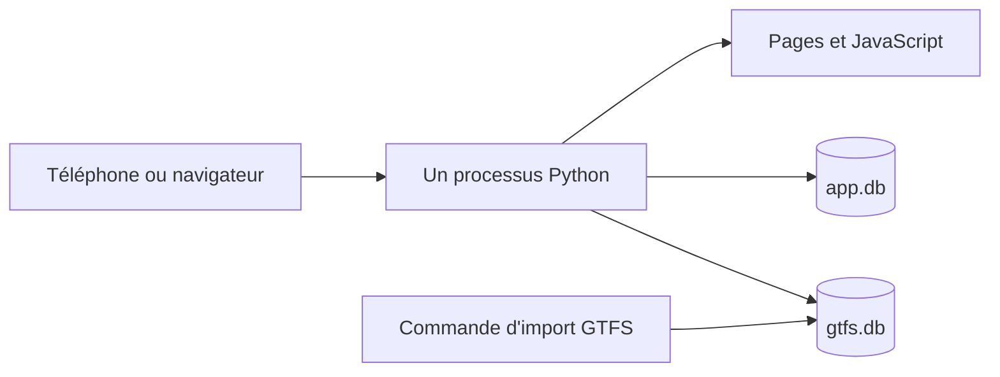

# ComptageFer

Outil collaboratif pour compter la fréquentation des TER en France, puis rendre ces comptages publics, lisibles et réutilisables.

**Statut :** cadrage, septembre 2026. Pas encore de code applicatif.

**Source du besoin :** cahier des charges « ComptagesFer » (présentation de trois diapositives).

**Dépôt :** https://github.com/LordD9/ComptageFer — licence du code : GPL-3.0.

**Décision d'architecture :** un seul processus Python, deux fichiers SQLite, pages statiques servies par ce processus. Aucun service managé. Le déploiement, c'est un conteneur : `docker compose up`, un volume pour les bases. Pas de second mode d'installation.

---

## 1. Le problème

Les données officielles de fréquentation des trains régionaux sont souvent confidentielles, hétérogènes, ou trop pauvres pour comparer des lignes. Beaucoup d'études en ont pourtant besoin : potentiel d'une ligne, offre à mettre en face, comparaison entre territoires.

L'idée est simple. Des gens déjà dans le train — passionnés, associations d'usagers, voyageurs, agents — comptent les voyageurs pendant leur trajet et le saisissent dans un outil léger. En retour, l'outil montre ce qui a été collecté. D'abord brut. Agrégé seulement quand la matière est suffisante, et seulement avec une méthode visible.

Le périmètre visé à terme : toutes les lignes TER de France, autocars compris quand l'offre théorique existe.

Ce dépôt est un projet personnel. Il ne porte pas la marque d'un établissement public.

## 2. Ce que l'outil doit permettre

### Contribuer

Le cas d'usage est un téléphone, dans un train, souvent avec un réseau médiocre.

1. J'indique où je suis, mon origine, ma destination, et l'heure.
2. L'outil propose les circulations commerciales issues du GTFS, centrées sur l'instant, avec la possibilité de regarder avant ou après.
3. Si ma circulation n'existe pas, je signale une offre manquante. Je ne l'invente pas dans le référentiel.
4. Je précise le contexte : date, heure de départ, heure d'arrivée prévue, véhicule (modèle et capacité si connus), retard, train précédent supprimé ou non, commentaire libre.
5. Je compte selon deux modes.
   - **Comptage unique.** Une interstation (les deux arrêts qui l'encadrent), un effectif, et trois indicateurs approximatifs : part de gens debout, part de places assises restantes, écart de charge entre la partie la plus chargée et la moins chargée.
   - **Serpent de charge.** Je monte, je compte une fois les portes fermées, puis à chaque arrêt j'indique montées et descentes jusqu'à ma descente. Les indicateurs du mode unique sont optionnels sur chaque interstation. Compter sa propre descente est optionnel.
6. En quittant, j'indique un pourcentage de fiabilité. Utile surtout quand le train est plein et que le compte est approximatif.

### Lire

1. Une carte, ou une recherche par nom de gare, origine, destination ou nom de ligne.
2. S'il n'y a rien : une invitation à compter, pas une page vide.
3. S'il y a peu de comptages : la liste, le type (unique ou serpent), les commentaires. Pas d'estimation déguisée en chiffre officiel.
4. S'il y en a assez : des estimations en voyageurs et en voyageurs.kilomètres à l'année, avec un découpage semaine / week-end, creux / pointe. Cette marche n'est pas la première. Elle exige une méthode écrite, parce qu'un échantillon de passionnés n'est pas un sondage.
5. Plus tard : comparer des lignes, agréger un lot de lignes, une agglomération ou une région, exporter des synthèses.

L'export des données brutes, lui, arrive tôt. C'est le retour dû aux gens qui comptent.

## 3. Principes

- **Simple à poser.** Un conteneur, une base fichier, pas de base managée. La commande est la même partout où Docker tourne.
- **Le téléphone dans le train est le client principal.** Grandes zones tactiles, peu d'étapes, une saisie qui ne se perd pas si le réseau coupe.
- **Brut avant estimé.** Pas de chiffre annuel tant que la règle d'extrapolation n'est pas écrite et affichée à côté du chiffre.
- **Anonyme par défaut.** Pas de compte pour contribuer. Un identifiant local permet de retrouver ses saisies, pas d'identifier une personne.
- **L'offre vient du GTFS, les comptages viennent des gens.** On ne mélange pas les deux. Une circulation absente est un signalement, pas une ligne créée à la main.
- **Pas de position GPS.** L'utilisateur désigne des arrêts.
- **Les comptages exportés sont des données ouvertes**, sous une licence de données distincte du code. Proposition : Licence Ouverte 2.0. Le code reste en GPL-3.0.
- **Un effectif saisi n'est pas une fréquentation officielle.** Chaque écran de résultat le dit.

## 4. Architecture



`app.db` garde les comptages. `gtfs.db` garde l'offre, et se reconstruit sans toucher aux comptages.

Rien d'autre. Pas de Postgres, pas de Redis, pas de file de messages, pas de frontend à builder sur le serveur.

### Pourquoi ce choix

La contrainte est de déployer la même chose quel que soit l'hébergeur. Donc un artefact, pas une procédure par machine.

Le déploiement est Docker Compose. Une commande, un conteneur, un volume `data/`. Ça ne complique pas : c'est ce qui évite de documenter un virtualenv, une unité systemd et un PaaS en parallèle. Trois notices, c'est trois façons de se tromper. Une seule, testée, suffit.

Docker compliquerait les choses s'il embarquait une base à part, un Redis, un worker. Ici il n'embarque que le processus. SQLite est un fichier dans le volume. Oublier le volume est le seul piège, et le `compose.yaml` le monte par défaut.

L'hôte doit savoir lancer un conteneur. VPS, Raspberry Pi, Coolify, NAS, PaaS conteneur : même commande. Un mutualisé sans Docker n'est pas une cible. Un import GTFS et une carte n'y tiendraient pas de toute façon.

| Option écartée | Raison |
| --- | --- |
| Next.js + Postgres managé (Vercel, Supabase, Firebase) | Deux runtimes, base à part, lié à un hébergeur. |
| Docker + Postgres | Un second conteneur pour une charge qui tient dans un fichier. |
| Microservices | Pas assez de charge, pas assez d'équipes. |
| Application native | Un store de plus, deux codebases. Le web mobile suffit. |
| PHP + SQLite | Très portable sur mutualisé, mais le GTFS et les calculs seront en Python. Inutile de couper en deux. |
| PocketBase seul | Pratique pour du CRUD, gênant dès que le rapprochement GTFS devient le cœur du métier. |
| Notice systemd en plus de Docker | Une seconde procédure qu'on ne testera pas. |

La configuration tient dans l'environnement : chemin des bases, jeton d'admin le moment venu, URL publique. Pas de fichier de config propre à un hébergeur.

SQLite en mode WAL suffit. Les écritures sont rares (un comptage par voyage), les lectures dominent. On migrera le jour où ça ne suffit plus. Ce jour n'est pas le premier.

Un reverse proxy (Caddy, nginx) est optionnel. Il sert au HTTPS. L'application n'en a pas besoin pour fonctionner.

### Pile

- Python 3.12
- FastAPI, servi par uvicorn
- SQLite
- HTML, CSS, un peu de JavaScript. Pas de framework.
- Leaflet et des tuiles OpenStreetMap. Pas de clé d'API.
- Pas de Node en production. Si un bundler devient utile, il reste un outil de développement.

### Offre théorique

Source de la v1 : le GTFS national « Réseau SNCF TGV, Intercités et TER », sur [transport.data.gouv.fr](https://transport.data.gouv.fr/datasets/horaires-sncf).

- Fichier : <https://eu.ftp.opendatasoft.com/sncf/plandata/Export_OpenData_SNCF_GTFS_NewTripId.zip>
- Horaires théoriques SNCF Voyageurs (TER, Intercités, TGV) pour les jours à venir, en GTFS et en NeTEx. On prend le GTFS.
- La version consultée en septembre 2026 fait environ 4,4 Mo, 721 lignes, modes train, car et tramway. Elle n'a pas de `shapes.txt`.
- Le temps réel existe (GTFS-RT, SIRI Lite). On ne s'en sert pas en v1. Le retard saisi par l'utilisateur suffit.

Conséquences :

- La carte v1 relie les arrêts ordonnés. Elle ne suit pas la voie réelle.
- Le GTFS national duplique souvent une gare en arrêt train et arrêt car. Le sélecteur doit montrer le mode.
- Les cars TER opérés par SNCF Voyageurs sont dans ce fichier. Les cars d'autorités régionales (liO, BreizhGo, Aléop, etc.) non. Même commande d'import, autres ZIP, plus tard.
- Certains TER ne sont plus opérés par SNCF Voyageurs. Ils ne sont pas dans ce fichier non plus.

L'import est une commande du même paquet, lancée à la main ou par cron. Ce n'est pas un second service.

```text
python -m comptagefer.gtfs import
```

### Fichiers de déploiement

```text
data/            # volume, hors git
  app.db
  gtfs.db
.env             # hors git
Dockerfile
compose.yaml
```

## 5. Modèle

Deux bases, pour pouvoir jeter l'offre sans toucher aux comptages.

### Offre (`gtfs.db`, jetable)

Tables utiles : `stops`, `routes`, `trips`, `stop_times`, `calendar` ou `calendar_dates`.

Index prévus : nom d'arrêt, `(stop_id, heure)`, `route_id`. On garde le mode (train, car, tram).

Les heures GTFS peuvent dépasser 24:00. La date de service n'est pas toujours la date civile. On stocke les deux, on n'invente pas de fuseau : l'offre française est en heure locale.

### Comptages (`app.db`, précieux)

**Session.** Un voyage saisi.

- `id` et `client_id`. Le `client_id` est un UUID créé dans le navigateur avant l'envoi. Il rend l'envoi idempotent : un réessai après un tunnel ne crée pas un doublon. On le pose dès la première saisie, pas à la phase hors-ligne.
- mode : `unique` ou `serpent`
- jeton contributeur anonyme, généré dans le navigateur
- date de service, heure de départ, heure d'arrivée prévue
- circulation GTFS si reconnue (`trip_id`, `route_id`), sinon rien
- origine et destination du voyageur, qui ne sont pas forcément celles du train
- contexte : modèle, capacité, retard en minutes, train précédent supprimé, commentaire
- fiabilité, entier de 0 à 100
- horodatage de réception

**Observation.** Une mesure dans la session.

- mode unique : une ligne, l'interstation, l'effectif, les trois indicateurs optionnels
- mode serpent : une suite ordonnée. Effectif portes fermées, puis montées et descentes par arrêt. Indicateurs optionnels par interstation.

Les pourcentages sont des estimations de l'utilisateur. On ne déduit pas l'un de l'autre.

**Signalement d'offre manquante.** Origine, destination, heure, commentaire. Sert à voir les trous du GTFS. Ne crée pas de ligne.

On ne stocke pas de position GPS.

## 6. Hors périmètre pour l'instant

- Comptes, mots de passe, OAuth.
- Estimation annuelle de voyageurs et de voyageurs.kilomètres.
- Comparaison de lignes, agrégats région ou agglomération.
- Géométrie réelle des lignes.
- Temps réel GTFS-RT.
- Application native, et PWA installable.
- Modération élaborée. Un jeton d'admin dans l'environnement suffira pour masquer une saisie aberrante.
- Édition du GTFS depuis l'interface.

## 7. Plan

Chaque phase se termine par quelque chose de déployable. On ne commence pas la suivante tant que la précédente n'est pas utilisable.

Le plan tâche par tâche, avec tests, s'écrit au début de chaque phase. Pas avant : le cadrage bougerait trop.

### Phase 0 — Cadrage

Ce document. À valider, surtout les questions de la section 8.

### Phase 1 — Squelette qui se déploie

Un processus qui démarre partout, avec une base vide et une page d'accueil.

Fichiers :

- `pyproject.toml`, paquet `comptagefer`
- `comptagefer/app.py` — `GET /` et `GET /health`
- création du schéma `app.db` au démarrage
- `Dockerfile`, `compose.yaml`, volume `./data`
- `.gitignore` pour `data/`, `.env`, `.venv/`
- notice de déploiement dans le README : `docker compose up`, et rien d'autre

Vérification : sur une machine neuve, `docker compose up` répond sur le port annoncé, et `data/app.db` survit à un redémarrage.

### Phase 2 — Import GTFS

Proposer une circulation à partir d'un arrêt et d'une heure.

- commande d'import du ZIP national
- `gtfs.db` en lecture seule côté API
- `GET /api/stops?q=`
- `GET /api/trips?stop_id=&at=` — circulations autour de l'heure, avant et après

Vérification : une grande gare à une heure de pointe renvoie des TER, et distingue train et car quand les deux existent.

### Phase 3 — Comptage unique

Le parcours téléphone, en ligne.

- formulaire : arrêts, choix de circulation, interstation, effectif, indicateurs, fiabilité
- `POST /api/sessions`, idempotent sur `client_id`
- identifiant contributeur en `localStorage`
- signalement d'offre manquante

Vérification : un comptage saisi est relu après redémarrage du conteneur. Renvoyer le même `client_id` ne crée pas une seconde session.

### Phase 4 — Lecture et export

Tenir la promesse du retour.

- liste des comptages
- carte Leaflet : arrêts comptés, segments droits entre les arrêts d'une saisie
- recherche par nom
- page ligne : liste brute, ou invitation à contribuer s'il n'y a rien
- `GET /api/export.csv`
- mention visible : ce n'est pas une fréquentation officielle

Vérification : le comptage de la phase 3 est sur la carte et dans le CSV.

### Phase 5 — Serpent de charge

Le second mode, pas avant que le premier soit solide.

- saisie arrêt par arrêt, reprise si on quitte la page
- reconstruction : effectif suivant = effectif + montées − descentes
- indicateurs de charge optionnels

Vérification : une session de trois arrêts donne un profil cohérent avec cette égalité.

### Phase 6 — Réseau coupé

Ne pas perdre un comptage dans un tunnel.

- si l'envoi échoue, le payload reste dans le navigateur
- réessai au retour du réseau, même `client_id`
- le choix de circulation, lui, se fait quand le réseau passe. Pas de GTFS hors ligne en v1.

Vérification : mode avion, saisie, retour réseau, une seule session créée.

Cette phase peut passer avant la carte si le terrain le demande. Voir la question 1.

### Phase 7 — Qualité minimale

- `ADMIN_TOKEN` pour masquer une saisie, comparaison en temps constant, jeton absent du dépôt
- refus : effectif négatif, fiabilité hors 0–100
- effectif au-dessus d'un plafond : signalé, pas bloqué
- page « méthode » : ce que les chiffres sont, ce qu'ils ne sont pas

### Ensuite, dans cet ordre

1. Géométries de lignes, si les segments droits ne suffisent plus. Jointure OSM, ou GTFS régionaux qui ont un `shapes.txt`.
2. Autres GTFS : cars d'AOM, TER non SNCF.
3. GTFS-RT, pour proposer la circulation réellement en retard plutôt que l'horaire théorique.
4. Méthode d'estimation annuelle, écrite avant d'être codée. Jours types, biais de qui compte, seuil minimal de comptages, voyageurs.kilomètres. Le chiffre affiche toujours son dénominateur.
5. Comparaison de lignes et agrégats géographiques.
6. Comptes optionnels, seulement s'il faut un historique fiable ou une modération qui ne tient pas dans un jeton.

## 8. Questions ouvertes

1. La file d'attente hors ligne passe-t-elle avant la carte ? Dans un TER, le réseau est le point faible.
2. Pseudo optionnel, ou anonyme strict ?
3. Confirmer : le dépôt public reste sans marque institutionnelle.
4. Confirmer : la v1 s'arrête au GTFS national SNCF. Cars TER SNCF inclus, cars d'AOM et opérateurs non SNCF exclus.
5. Confirmer : Licence Ouverte 2.0 pour les comptages exportés.
6. Fermée. Le déploiement est `docker compose up`. L'hébergeur est celui qui lance un conteneur. Pas de notice systemd.

## 9. Ce qui n'est pas une promesse

Un effectif saisi par un voyageur n'est pas une fréquentation officielle. Les estimations annuelles, le jour où elles existeront, afficheront le nombre de comptages sous-jacents et la règle utilisée. Pas de chiffre sans dénominateur.
