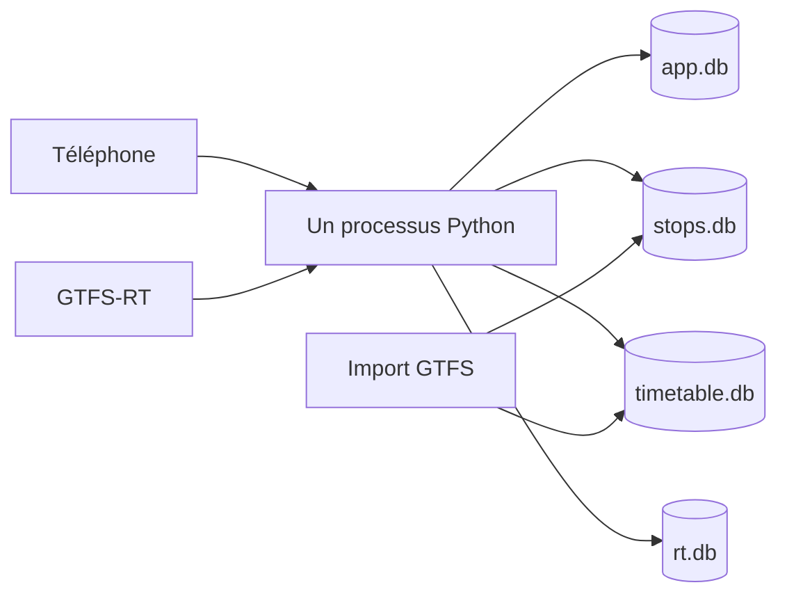

# ComptagesFer

Outil collaboratif pour compter la fréquentation des TER en France, puis rendre ces comptages publics, lisibles et réutilisables.

**Statut :** phases 0 à 8 livrées, septembre 2026. Phase 9 commencée — les vagues 2 et 3 sont écrites : compte par secret long, rattachement, signalement, historique, score et classement. Les parcours Chromium de compte sont couverts. L'audit a corrigé les défauts de confidentialité, d'origine, de cookies et de sessions ; la variable HTTPS est câblée et documentée. Restent la vérification HTTPS sur le déploiement réel et la calibration des coefficients sur sa base ; les passkeys sont étudiées, non implémentées. Le détail est dans « Ce qui reste » plus bas. Ce document reste la source de vérité : quand le code et le plan divergent, le plan est corrigé dans le même changement.

**Source du besoin :** cahier des charges « ComptagesFer » (présentation de trois diapositives).

**Dépôt :** https://github.com/LordD9/ComptageFer — licence du code : GPL-3.0.

**Décision d'architecture :** un seul processus Python, deux fichiers SQLite, pages statiques servies par ce processus. Aucun service managé. Le déploiement, c'est un conteneur : `docker compose up`, un volume pour les bases. Pas de second mode d'installation.

---

## 1. Le problème

Les données officielles de fréquentation des trains régionaux sont souvent confidentielles, hétérogènes, ou trop pauvres pour comparer des lignes. Beaucoup d'études en ont pourtant besoin : potentiel d'une ligne, offre à mettre en face, comparaison entre territoires.

L'idée est simple. Des gens déjà dans le train — passionnés, associations d'usagers, voyageurs, agents — comptent les voyageurs pendant leur trajet et le saisissent dans un outil léger. En retour, l'outil montre ce qui a été collecté. D'abord brut. Agrégé seulement quand la matière est suffisante, et seulement avec une méthode visible.

Le périmètre visé à terme : toutes les lignes TER de France, autocars compris quand l'offre théorique existe.

Ce dépôt est un projet personnel. Il ne porte pas la marque d'un établissement public.

## 2. Ce que l'outil doit permettre

### Contribuer

Le cas d'usage est un téléphone, dans un train, souvent avec un réseau médiocre. La saisie part d'une origine et d'une destination. La carte vient après, pour lire les résultats.

1. J'ouvre l'application. Si je l'autorise, la position propose la gare la plus proche, puis elle est oubliée. Sinon je cherche mon origine.
2. Je donne ma destination.
3. L'outil liste les circulations qui desservent cette origine-destination, sur une plage de 4 heures centrée sur maintenant : les deux heures passées, les deux heures à venir. L'heure et l'état viennent du flux temps réel, pas de l'horaire théorique. Je sélectionne mon train. S'il n'y est pas, je signale une offre manquante. Je ne l'invente pas dans le référentiel.
4. Je passe au formulaire. Le retard, l'heure et la suppression ne se tapent pas.
   - **Comptage unique.** Une interstation (les deux arrêts qui l'encadrent), un effectif, et trois indicateurs approximatifs : part de gens debout, part de places assises restantes, écart de charge entre la partie la plus chargée et la moins chargée.
   - **Serpent de charge.** Je monte, je compte une fois les portes fermées, puis à chaque arrêt j'indique montées et descentes jusqu'à ma descente. Les indicateurs du mode unique sont optionnels sur chaque interstation. Compter sa propre descente est optionnel.
5. Pseudo, si je veux. Facultatif. Un compte, si je veux aussi : facultatif lui aussi, jamais demandé, et il ne donne aucun droit sur les données des autres. La connexion se fait par un secret long que l'outil affiche une fois — rien à retenir, et aucune adresse email n'est demandée.
6. En quittant, j'indique un pourcentage de fiabilité. Commentaire et modèle de véhicule seulement si j'ai quelque chose à ajouter.

À la sélection, l'outil fige l'état du train choisi, du précédent et du suivant sur la même origine-destination. C'est cette photo qui voyage avec le comptage. On ne relit pas le flux plus tard pour reconstituer le contexte : il ne le contient plus.

### Lire

1. Une carte, ou une recherche par nom de gare, origine, destination ou nom de ligne.
2. S'il n'y a rien : une invitation à compter, pas une page vide.
3. S'il y a peu de comptages : la liste, le type (unique ou serpent), les commentaires. Pas d'estimation déguisée en chiffre officiel.
4. S'il y en a assez : des estimations en voyageurs et en voyageurs.kilomètres à l'année, avec un découpage semaine / week-end, creux / pointe. Cette marche n'est pas la première. Elle exige une méthode écrite, parce qu'un échantillon de passionnés n'est pas un sondage.
5. Plus tard : comparer des lignes, agréger un lot de lignes, une agglomération ou une région, exporter des synthèses.

L'export des données brutes, lui, arrive tôt. C'est le retour dû aux gens qui comptent.

## 3. Principes

- **Simple à poser.** Un conteneur, une base fichier, pas de base managée. La commande est la même partout où Docker tourne.
- **Le téléphone dans le train est le client principal.** Grandes zones tactiles, peu d'étapes. On saisit le compte, pas le contexte que le flux connaît déjà.
- **Brut avant estimé.** Pas de chiffre annuel tant que la règle d'extrapolation n'est pas écrite et affichée à côté du chiffre. Une suppression du train précédent est un fait conservé, pas un effectif qu'on réécrit.
- **Anonyme par défaut, et c'est encore vrai.** On peut contribuer sans compte, sans pseudo, et sans rien laisser qui permette de retrouver qui a compté. Un compte existe depuis la phase 9 et n'est jamais demandé : il donne un historique et un classement, et rien qui touche aux données des autres. Aucune adresse email n'est stockée, aucune. Un pseudo facultatif peut signer un comptage. Il n'identifie personne, et il n'ouvre aucun droit.
- **L'offre vient du GTFS, le contexte du temps réel, les comptages des gens.** On ne mélange pas les trois. Une circulation absente est un signalement, pas une ligne créée à la main.
- **Pas de trace GPS.** La position peut proposer l'arrêt le plus proche. Elle n'est pas enregistrée.
- **Les comptages partagés sont en Licence Ouverte 2.0.** Le code reste en GPL-3.0. Les deux licences ne se mélangent pas.
- **Pas de marque institutionnelle**, pour le moment. Le dépôt est personnel.
- **Un effectif saisi n'est pas une fréquentation officielle.** Chaque écran de résultat le dit.

## 4. Architecture


```mermaid
flowchart LR
  phone[Téléphone] --> app[Un processus Python]
  app --> appdb[(app.db)]
  app --> stopsdb[(stops.db)]
  app --> timedb[(timetable.db)]
  app --> rtdb[(rt.db)]
  feeds[GTFS-RT] --> app
  cron[Import GTFS] --> timedb
  cron --> stopsdb
```

Quatre bases, pas trois, et les noms ont changé depuis le cadrage :

- `app.db` garde les comptages et la photo du contexte au moment de la saisie. **Précieux**, jamais jeté.
- `stops.db` garde les noms de gares, tirés uniquement de `stops.txt`. Pas l'horaire. Jetable.
- `timetable.db` garde l'offre théorique. Jetable. *C'est le fichier que le plan appelait `gtfs.db`.*
- `rt.db` garde quelques heures de temps réel. Jetable.

Le plan initial prévoyait `gtfs.db` pour l'offre et `stops.db` pour les noms. À l'usage, l'offre et les noms sont deux fichiers distincts : l'import des noms est rapide et sert dès la recherche, alors que l'offre est lourde et n'a pas lieu d'être rechargée. D'où `stops.db` pour les noms, `timetable.db` pour l'offre.

Rien d'autre. Pas de Postgres, pas de Redis, pas de file de messages, pas de frontend à builder sur le serveur.

### Pourquoi ce choix

La contrainte est de déployer la même chose quel que soit l'hébergeur. Donc un artefact, pas une procédure par machine.

Le déploiement est Docker Compose. Une commande, un conteneur, un volume `data/`. Ça ne complique pas : c'est ce qui évite de documenter un virtualenv, une unité systemd et un PaaS en parallèle. Trois notices, c'est trois façons de se tromper. Une seule, testée, suffit.

Docker compliquerait les choses s'il embarquait une base à part, un Redis, un worker. Ici il n'embarque que le processus. SQLite est un fichier dans le volume. Oublier le volume est le seul piège, et le `compose.yaml` le monte par défaut.

L'hôte doit savoir lancer un conteneur. VPS, Raspberry Pi, Coolify, NAS, PaaS conteneur : même commande. Un mutualisé sans Docker n'est pas une cible. Un import GTFS et une carte n'y tiendraient pas de toute façon.

| Option écartée | Raison |
| --- | --- |
| Next.js + Postgres managé (Vercel, Supabase, Firebase) | Deux runtimes, base à part, lié à un hébergeur. |
| Docker + Postgres | Un second conteneur pour une charge qui tient dans un fichier. |
| Microservices | Pas assez de charge, pas assez d'équipes. |
| Application native | Un store de plus, deux codebases. Le web mobile suffit. |
| PHP + SQLite | Très portable sur mutualisé, mais le GTFS et les calculs seront en Python. Inutile de couper en deux. |
| PocketBase seul | Pratique pour du CRUD, gênant dès que le rapprochement GTFS devient le cœur du métier. |
| Notice systemd en plus de Docker | Une seconde procédure qu'on ne testera pas. |

La configuration tient dans l'environnement : chemin des bases, jeton d'admin le moment venu, URL publique. Pas de fichier de config propre à un hébergeur.

SQLite en mode WAL suffit. Les écritures sont rares (un comptage par voyage), les lectures dominent. On migrera le jour où ça ne suffit plus. Ce jour n'est pas le premier.

Un reverse proxy (Caddy, nginx) est optionnel. Il sert au HTTPS. L'application n'en a pas besoin pour fonctionner.

### Pile

- Python 3.12
- FastAPI, servi par uvicorn
- SQLite
- HTML, CSS, un peu de JavaScript. Pas de framework.
- Leaflet et des tuiles OpenStreetMap. Pas de clé d'API.
- Pas de Node en production. Si un bundler devient utile, il reste un outil de développement.

### Offre théorique

Source de la v1 : le GTFS national « Réseau SNCF TGV, Intercités et TER », sur [transport.data.gouv.fr](https://transport.data.gouv.fr/datasets/horaires-sncf).

- Fichier : <https://eu.ftp.opendatasoft.com/sncf/plandata/Export_OpenData_SNCF_GTFS_NewTripId.zip>
- Horaires théoriques SNCF Voyageurs (TER, Intercités, TGV) pour les jours à venir, en GTFS et en NeTEx. On prend le GTFS.
- La version consultée en septembre 2026 fait environ 4,4 Mo, 721 lignes, modes train, car et tramway. Elle n'a pas de `shapes.txt`.

### Temps réel

Le temps réel sert à ne pas faire saisir le contexte. Il ne sert pas à réécrire le comptage.

Sources, sur le même jeu SNCF :

- Trip Updates : <https://proxy.transport.data.gouv.fr/resource/sncf-gtfs-rt-trip-updates>
- Service Alerts : <https://proxy.transport.data.gouv.fr/resource/sncf-gtfs-rt-service-alerts>

Le flux Trip Updates est une photo des trains qui circulent dans les 60 prochaines minutes, rafraîchie toutes les 2 minutes. Il n'a pas d'historique. Un train déjà parti en sort. Une suppression d'il y a deux heures n'y est plus.

La liste vient du cache temps réel, pas de l'horaire théorique. Chaque train du flux porte déjà son heure absolue et ses arrêts. On garde ceux dont le départ tombe dans la fenêtre de 4 heures. Le flux vivant ne couvre que l'heure qui vient : le passé vient du cache, et l'heure au-delà n'apparaît que lorsqu'elle entre dans le flux. Le flux n'a pas le nom des gares. Une table de noms, tirée uniquement de `stops.txt`, sert à la recherche. Ce n'est pas l'horaire.

Le processus interroge le flux toutes les 2 minutes et garde 6 heures dans `rt.db`, puis efface.

À la sélection, on copie trois lignes dans `app.db` : le train choisi, le précédent, le suivant, sur la même origine-destination. Cette copie survit à l'effacement du cache. Si le flux ne sait pas, l'état est `inconnu`. On ne l'invente pas, et le comptage n'est pas bloqué.

Même origine-destination veut dire : le train immédiatement précédent et le train immédiatement suivant qui desservent les deux arrêts du voyageur. C'est l'unité utile pour un report de charge. Si aucun voisin ne dessert les deux arrêts, on prend le voisin sur la même ligne au départ de l'origine, et on le marque comme correspondance faible.

Si Trip Updates est vide, le même cycle essaie le SIRI ET Lite avant de déclarer l'état inconnu. Ce n'est pas un second service. Les deux flux ont la même fenêtre de 60 minutes.

Le poller tourne dans le processus déjà lancé par Compose. Pas de second conteneur.

On ne déduit pas un report de voyageurs d'une suppression. On conserve le fait. L'interprétation viendra avec une méthode, ou pas.

Conséquences :

- La carte v1 relie les arrêts ordonnés. Elle ne suit pas la voie réelle.
- Le GTFS national duplique souvent une gare en arrêt train et arrêt car. Le sélecteur doit montrer le mode.
- Les cars TER opérés par SNCF Voyageurs sont dans ce fichier. Les cars d'autorités régionales (liO, BreizhGo, Aléop, etc.) non. Même commande d'import, autres ZIP, plus tard.
- Certains TER ne sont plus opérés par SNCF Voyageurs. Ils ne sont pas dans ce fichier non plus.

L'import est fait par le processus lui-même, au démarrage, quand les bases manquent. C'est un choix de déploiement autant que de conception : la seule façon de lancer l'application est `docker compose up -d`, donc une installation qui exige une commande d'import séparée est une installation qui peut échouer à moitié. Le référentiel est donc réduit à une variable : le volume `data/` arrive vide, le conteneur remplit les bases, la page fonctionne.

`ensure_referential()` fait le travail, une fois :

- elle télécharge le ZIP national, une seule fois, à froid
- elle extrait `stops.txt`, `trips.txt`, `stop_times.txt` et `calendar_dates.txt`
- elle remplit `stops.db` si elle est absente ou vide, et `timetable.db` si elle est absente
- l'offre est écrite dans `timetable.importing` puis renommée, donc un import interrompu ne laisse pas une base à moitié construite
- si les deux bases sont déjà là, elle ne télécharge rien

**Conséquence à garder en tête :** rafraîchir un horaire périmé n'est pas une opération prévue. Il faut supprimer `timetable.db` et redémarrer le conteneur. La SNCF publie un jeu mensuel environ, donc une commande de rafraîchissement est à ajouter quand la question se posera vraiment, pas avant.

Les tests contournent ce chemin : `tests/test_browser.py` écrit sa propre base GTFS miniature, ce qui garde la suite rapide et sans réseau.

### Fichiers de déploiement

```text
data/            # volume, hors git
  app.db         # comptages + photo du contexte — précieux
  stops.db       # noms de gares — jetable
  timetable.db   # offre théorique — jetable
  rt.db          # cache temps réel, quelques heures — jetable
.env             # hors git, contient ADMIN_TOKEN
Dockerfile
compose.yaml     # déclare ADMIN_TOKEN, ne contient pas sa valeur
```

Celui qui lance le conteneur définit `ADMIN_TOKEN` dans `.env`, lu par Compose. Ce jeton est l'administration : masquer une saisie, rien de plus. Il n'est pas dans l'image, ni dans git. Pas de compte administrateur.

## 5. Modèle

Trois fichiers jetables pour l'offre et le temps réel, un fichier précieux pour les comptages. On peut jeter `stops.db`, `timetable.db` et `rt.db` sans toucher aux saisies.

### Offre (`timetable.db`, jetable)

Tables utiles : `stops`, `routes`, `trips`, `stop_times`, `calendar_dates`.

Index prévus : nom d'arrêt, `(stop_id, heure)`, `route_id`. On garde le mode (train, car, tram).

Les heures GTFS peuvent dépasser 24:00. La date de service n'est pas toujours la date civile. On stocke les deux, on n'invente pas de fuseau : l'offre française est en heure locale.

### Noms de gares (`stops.db`, jetable)

Une seule table, `stop`, tirée de `stops.txt` uniquement. Elle sert la recherche par nom et la gare la plus proche. Le GTFS national ne donne pas les coordonnées dans un fichier séparé : elles viennent du même `stops.txt`, quand elles y sont.

Le flux temps réel ne donne pas le nom des gares, et il travaille surtout en StopPoint là où la recherche renvoie un StopArea. D'où deux tables : celle-ci pour chercher, `timetable.db` pour l'horaire.

### Comptages (`app.db`, précieux)

**Une seule table, `saisie`.** Le cadrage prévoyait trois tables — session, observation, signalement — séparées. En pratique les trois sont arrivées d'un coup et toujours ensemble : une observation sans session n'a pas de sens, un signalement n'a pas d'observation. Séparer aurait introduit trois clés étrangères pour rien. Donc une table, et `kind` fait la discrimination : `count`, `serpent`, `missing`.

- `client_id` en clé primaire. C'est un UUID créé dans le navigateur avant l'envoi. Il rend l'envoi idempotent : un réessai après un tunnel ne crée pas un doublon. On le pose dès la première saisie, pas à la phase hors-ligne.
- `kind` : `count`, `serpent` ou `missing`
- origine et destination, qui ne sont pas forcément celles du train
- `trip_id`, la circulation confirmée, sinon rien
- `passengers`, l'effectif. En mode serpent c'est l'effectif portes fermées : c'est le nombre saisi, pas le total reconstruit. La reconstruction reste dans `legs`.
- `reliability`, entier de 0 à 100
- `pseudo`, facultatif, texte libre court. Pas un compte, pas un droit. Il reste ce que le CSV publie, y compris quand la personne a un compte : le compte en a un aussi, mais il ne sort pas.
- `compte_id`, facultatif, ajouté par la phase 9. Un identifiant de compte, ou rien. Il rattache un relevé à son auteur dans l'application, et **n'est exporté nulle part** : ni dans le CSV, ni dans une URL, ni dans un journal, ni dans une page. Le CSV est un jeu ouvert, republicisé chaque nuit, et y écrire un identifiant stable y produirait une donnée personnelle que ni le pseudo ni la Licence Ouverte ne demandent. La migration l'ajoute par `ALTER TABLE`, donc les relevés antérieurs gardent `NULL` : ils comptent dans les données et pas au classement.
- `comment`, facultatif, texte libre court. C'est la partie qui explique un comptage atypique : train précédent supprimé, car de substitution, forte charge. Il est publié dans le CSV, donc lu par ceux qui réutilisent les données, et affiché dans l'admin.
- `standing`, `seats_free`, `imbalance`, optionnels
- `legs`, le profil du serpent, en JSON. La suite ordonnée des arrêts avec l'effectif de départ puis montées et descentes. Effectif suivant = effectif + montées − descentes.
- `trajet`, le trajet **complet** du train, en JSON, figé au moment du comptage. La suite ordonnée de tous ses arrêts, avec l'heure de départ de chacun. Un comptage ne parle que du tronçon où l'on a compté ; le train venait d'ailleurs et continuait ailleurs, et c'est cette charge-là qu'une estimation de fréquentation cherche à l'étape suivante. On fige parce que le GTFS est rechargé : une ligne peut changer de gares, et la saisie doit dire ce qu'elle a vue. Sans `trip_id` il n'y a rien à figer — deviner le train serait fabriquer de la donnée — et un « train signalé » n'en a pas non plus, puisque c'est un doute sur une ligne, pas une observation.
- `snapshot`, la photo du contexte, en JSON : le train choisi, le précédent, le suivant, et les voisins du même type commercial, avec leurs états, retards, sources et l'instant de la prise. Le CSV conserve les cinq états séparément ; les deux colonnes de voisins du même type sont ajoutées après les colonnes historiques. Une absence reste une cellule vide, pas un état déduit.
- `voitures`, la répartition par voiture, en JSON. Une liste d'objets `{"rame", "position", "passengers"}`, une entrée par voiture comptée. La somme vaut `passengers`. C'est la seule colonne qui dit **où** sont les gens dans la rame, et pas seulement combien ils sont : une rame à 180 voyageurs répartis sur quatre voitures ne se lit pas comme une rame à 180 dans une seule.
- `rames`, la répartition par rame, en JSON. Une liste d'objets `{"rame", "passengers"}`, une entrée par rame comptée. La somme vaut `passengers`. Sans elle, un comptage en UM3 ne dit pas si les 180 voyageurs sont dans une rame ou dans les trois.
- `created_at`, horodatage de réception

Les pourcentages sont des estimations de l'utilisateur. On ne déduit pas l'un de l'autre.

La photo du contexte est prise à la sélection du train, pas au moment de l'envoi. Elle est renvoyée au téléphone avec la liste, et renvoyée avec le comptage. Un envoi tardif, après un tunnel, ne relit pas le flux : l'état aurait changé, ou disparu. Elle contient, pour le train choisi et ses voisins :

- départ théorique à l'arrêt d'origine
- état : `programmé`, `à l'heure`, `retard`, `avance`, `supprimé`, `inconnu`
- retard en minutes, s'il est connu
- source : `tu`, `alerte`, `siri`, `aucune`
- instant de la prise
- correspondance `forte` (les deux arrêts) ou `faible` (même ligne, origine seulement)

On ne stocke pas de position GPS.

## 6. Hors périmètre pour l'instant

- Mots de passe à retenir, et tout ce qui en dépend : OAuth, fournisseurs externes d'identité. Le compte de la phase 9 affiche un **secret long** une seule fois, à conserver soi-même. Il n'y a ni mot de passe, ni adresse email, ni fournisseur d'identité : le dépôt est personnel, et un compte qui se connecte chez quelqu'un d'autre n'est plus un compte du projet.
- Passkey WebAuthn pour la connexion. Noté ici parce que c'est **la bonne réponse** à ce que la phase 9 règle de travers — le serveur ne stockerait qu'une clé publique, et la clé privée ne quitterait jamais le téléphone — et qu'elle est écartée pour une raison concrète, écrite plus bas : c'est du JavaScript, donc du travail que la suite de tests n'exerce pas encore sur cette page.
- Messagerie : aucune notification, aucun récapitulatif, aucune relance. Le compte n'écrit pas à personne.
- Estimation annuelle de voyageurs et de voyageurs.kilomètres.
- Comparaison de lignes, agrégats région ou agglomération.
- Géométrie réelle des lignes.
- Archivage permanent de tout le flux national. Seuls le cache court et les photos liées à un comptage sont gardés.
- Application native, et PWA installable.
- Modération multi-utilisateurs. L'administration, c'est `ADMIN_TOKEN` dans l'environnement du conteneur.
- Édition du GTFS depuis l'interface.

## 7. Plan

Chaque phase se termine par quelque chose de déployable. On ne commence pas la suivante tant que la précédente n'est pas utilisable.

Le plan tâche par tâche, avec tests, s'écrit au début de chaque phase. Pas avant : le cadrage bougerait trop.

### Phase 0 — Cadrage

Ce document. Les questions de la section 8 sont tranchées. **Livrée.**

### Phase 1 — Squelette qui se déploie

Un processus qui démarre partout, avec une base vide et une page d'accueil.

Fichiers :

- `pyproject.toml`, paquet `comptagefer`
- `comptagefer/app.py` — `GET /` et `GET /health`
- création du schéma `app.db` au démarrage
- `Dockerfile`, `compose.yaml`, volume `./data`
- `.gitignore` pour `data/`, `.env`, `.venv/`
- `compose.yaml` déclare `ADMIN_TOKEN`, la valeur vient du `.env` local
- notice de déploiement dans le README : `docker compose up`, et le jeton d'admin à définir au lancement

Vérification : sur une machine neuve, `docker compose up` répond sur le port annoncé, et `data/app.db` survit à un redémarrage. **Livrée.**

### Phase 2 — Import GTFS

Proposer une circulation à partir d'un arrêt et d'une heure.

- import du ZIP national, au démarrage et seulement si les bases manquent
- `timetable.db` en lecture seule côté API
- `GET /api/stops?q=`
- `GET /api/trips?stop_id=&at=` — circulations autour de l'heure, avant et après

Vérification : une grande gare à une heure de pointe renvoie des TER, et distingue train et car quand les deux existent. **Livrée**, avec le contournement décrit en section 4 : pas de commande séparée.

### Phase 3 — Saisie : origine, destination, train, compte

Le parcours téléphone. On choisit un train dans une liste, on ne le décrit pas.

- poller dans le même processus : Trip Updates et alertes toutes les 2 minutes, cache 6 heures dans `rt.db`
- repli SIRI ET Lite si Trip Updates est vide
- `GET /api/trips?from=&to=&at=` : circulations du cache temps réel qui desservent les deux arrêts entre `at - 2 h` et `at + 2 h`
- à la sélection, photo du train choisi, du précédent et du suivant
- formulaire : interstation, effectif, indicateurs, fiabilité, pseudo et commentaire facultatifs
- `POST /api/sessions` enregistre le comptage, le pseudo et le commentaire s'il y en a, et la photo reçue, sans relire le flux
- idempotent sur `client_id`
- signalement d'offre manquante

Vérification : la liste d'une origine-destination couvre bien 4 heures. Un comptage relu après effacement de `rt.db` a encore ses trois circulations et leurs états. Renvoyer le même `client_id` ne crée pas une seconde session. Couper le flux ne bloque pas la saisie. **Livrée.**

### Phase 4 — Réseau coupé

Priorité avant la carte. Dans un TER, le réseau lâche. Un comptage perdu ne sert à personne.

- si l'envoi échoue, le payload reste dans le navigateur, photo comprise
- réessai au retour du réseau, même `client_id`
- le choix du train se fait quand le réseau passe. Pas de GTFS hors ligne en v1.

Vérification : mode avion après la sélection, saisie, retour réseau, une seule session créée, avec la photo prise avant le tunnel. **Livrée.** Une nuance : le test coupe le réseau au niveau du navigateur, pas au niveau radio.

### Phase 5 — Serpent de charge

Le second mode, pas avant que le premier survive à un tunnel.

- saisie arrêt par arrêt, le profil est conservé dans la file hors ligne comme le reste
- même file d'attente que la phase 4
- reconstruction : effectif suivant = effectif + montées − descentes
- indicateurs de charge optionnels

Vérification : une session de trois arrêts donne un profil cohérent avec cette égalité. **Livrée**, y compris *reprendre une saisie de serpent en quittant la page et en revenant plus tard*. La file hors ligne ne le couvrait pas : elle ne transporte que ce qui doit partir vers le serveur, pas une saisie en cours. Le serpent est donc écrit dans le `localStorage` à chaque « Suivant », et proposé au chargement, avec un bouton pour l'abandonner. Un serpent vide ne propose rien, et un serpent parti n'est plus proposé.

### Phase 6 — Lecture, carte, export

La carte sert à voir les résultats, pas à saisir.

- liste des comptages, pseudo affiché s'il a été donné — **fait**
- `GET /api/export.csv`, licence indiquée : Licence Ouverte 2.0 — **fait**
- mention visible : ce n'est pas une fréquentation officielle — **fait**
- carte Leaflet : arrêts comptés, tracés le long de la voie ferrée réelle — **fait**, c'est `/carte`
  - le tracé est routé sur le réseau ferré national (Cerema, Licence Etalab 2.0),
    pas interpolé entre deux arrêts ; un Paris–Marseille suit les voies
  - quand le réseau ne relie pas deux arrêts, le segment reste droit, et le
    bas de page dit combien de tracés sont dans ce cas
  - les marqueurs restent sur les gares : le tracé ne les déplace pas
  - un serpent est dessiné arrêt par arrêt, pas comme un couple origine-destination
  - un arrêt enfant sans position prend celle de sa gare
  - moins de deux arrêts plaçables, la saisie n'est pas dessinée et la page le dit
  - fond de plan : tuiles raster OpenStreetMap, aucune clé d'API. La politique d'usage d'OSM est le
    vrai plafond ; un fournisseur de tuiles se change en une constante
  - Leaflet vient d'un CDN : sans réseau, la page le dit et garde la liste des tracés
  - le zoom à la molette est actif ; les comptages se consultent en cliquant sur
    une section de voie, pas sur un marqueur de gare
  - une section réunit les comptages qui la parcourent dans les deux sens,
    y compris les parcours qui ne la recouvrent que partiellement
  - jusqu'à trois comptages, l'infobulle les détaille ; au-delà, elle indique
    « X comptages ». Le clic ouvre tous les comptages de la section dans une
    liste latérale sur grand écran, sous la carte sur téléphone
- recherche par gare ou par ligne — **retirée** : les informations GTFS sur les lignes ne sont pas assez fiables pour une recherche utile. Les filtres de comptages restent dans `/comptages`
- page gare : les relevés dont la gare est une extrémité, ou un arrêt traversé par un serpent — **fait**, c'est `/gare`, ajouté le 1er octobre 2026 avec `/releve`
- fiche d'un relevé : la page `/comptages` est un résumé, et le reste (rame, périmètre, indicateurs, commentaire, arrêts du serpent) n'était lisible qu'en téléchargeant le CSV — **fait**, c'est `/releve?client_id=&kind=`, adossée à la clé primaire. La carte et la ligne du tableau y mènent toutes les deux, parce que ce ne sont pas deux rendus de la même chose sur un écran donné. Les **gares du parcours figé** y sont également rendues, dans l'ordre et avec leur heure : la donnée était dans la colonne `trajet` du CSV, donc lisible seulement par qui télécharge le fichier — sur un téléphone, dans un train, ce n'est pas une option. L'heure est réduite modulo 24 h, parce que le GTFS écrit 25:30 pour 1 h 30 le lendemain et qu'un lecteur y verrait une saisie fausse

Trois décisions valent d'être écrites, parce qu'aucune ne se devine dans le code :

- **Le rattachement à une gare se fait par sa famille**, pas par l'identifiant exact. Un même quai peut s'appeler `StopArea:Annecy` dans une offre et `StopPoint:AnnecyA` dans une autre ; chercher le seul identifiant du lien afficherait « aucun comptage » pour une gare qui en a un. C'est `_stop_family`, celle que le serpent et le temps réel utilisent déjà — pas une troisième définition du même mot
- **Un champ de filtre est un enfant de grille, pas une balise.** Le formulaire est une grille à quatre colonnes ; ses enfants étaient les `<label>` et les `<input>`, donc la grille les répartissait alternativement et aucun champ n'était sous son libellé au-dessus de 48 rem. C'est invisible dans le HTML relu, et c'est pour ça que `tests/test_browser_ui.py` mesure la géométrie dans un vrai Chromium plutôt que de relire des balises
- **Un tableau ne remplace pas une pile de cartes sur un téléphone.** Le classement en tableau rend les nombres alignés, ce qu'aucune carte ne fait ; mais sept colonnes débordent de 145 px en 390 px, ce que `tests/test_browser_compte.py` mesurait déjà. Les deux lectures coexistent donc dans le HTML, comme la liste des relevés, et la feuille de style en choisit une

#### La lecture sur un écran large

Sept pages recopient chacune leur mise en page, et sept fois le même `max-width: 32rem`. Le mobile y est bon — le formulaire se fait au pouce, dans un train — mais `/comptages` sur un écran large, c'était une colonne de 512 px centrée, avec la moitié de la hauteur en vide.

Le chrome est donc écrit une fois, dans `comptagefer/affichage.py` : en-tête, navigation, pied, et une media query qui ouvre la lecture à 72 rem au-delà de 48 rem. Trois décisions valent d'être écrites ici, parce qu'elles ne se devinent pas dans le CSS :

- **Une page, deux lectures.** La liste existe en cartes et en tableau, dans le même HTML : les cartes sur un téléphone, le tableau sur grand écran, l'un retiré du rendu quand l'autre s'affiche. Les faire coexister ferait lire chaque relevé deux fois. Le tableau ajoute ce qui manquait : date, fiabilité, tri par en-tête. Le tri est un paramètre d'URL (`?tri=&sens=`) et non un état navigateur : une liste triée se partage et se teste, et il n'y a pas de JavaScript dans une page dont le JavaScript n'est jamais exécuté par la suite de tests.
- **Un relevé sans valeur sort en dernier, dans les deux sens.** Un « train signalé » n'a pas d'effectif : trié décroissant, il remonterait en tête et se lirait comme le relevé le plus chargé. `reverse=True` portant sur un « la valeur manque » booléen fait exactement ça, donc ils sont retirés, triés, puis remis à la fin.
- **Ce qui est dans la base est sur la page.** `created_at`, `reliability`, `comment`, `standing`, `seats_free`, `imbalance` sortaient dans le CSV sans qu'un lecteur du site puisse les voir. La date est en heure de Paris, pas en ISO UTC.

La carte prend la hauteur de l'écran sur grand écran, la liste des tracés passe à côté. C'est une media query, pas une refonte : rien n'a été ajouté au-delà de 48 rem, et le téléphone ne change pas.

#### Filtrer, et comparer par paire de gares

Un écran large sert d'abord à comparer, donc `comptagefer/filtres.py` porte les filtres de `/comptages` — `?depuis=&jusqu=&mode=&gare=&gare2=` — plus la vue `?vue=paire`. Sept décisions ne se devinent pas dans le code :

- **Les filtres sont dans l'URL, et tous les liens de la page les conservent.** C'est le prolongement du tri : une liste filtrée se partage et se teste. Le corollaire est la faute que pytest ne voit pas — un lien de tri qui reconstruit son URL perd le `ligne=` courant, et le lecteur voit les relevés qu'il vient d'exclure. Toutes les URL passent donc par une seule fabrique, qui prend l'état courant et le modifie au lieu de le reconstruire.
- **Un filtre illisible est écarté *et nommé*.** L'écarter en silence est pire que ne pas l'écarter : le lecteur qui filtre par « laisse-passer » verrait la liste entière et croirait que son filtre n'a rien donné. La page affiche donc la raison de l'écart dans le formulaire, et les chips disent ce qui est *appliqué*.
- **`?gare=` passe par la famille d'identifiants, et prend les gares intermédiaires.** Le champ du formulaire est un **nom de gare**, résolu dans le catalogue par égalité sur une clé normalisée (voir la décision suivante) — un `LIKE '%nom%'` ramènerait « Lyon Part-Dieu » pour « Lyon », et le lecteur verrait les comptages d'une gare qu'il n'a pas demandée ; un nom inconnu est donc écarté **et nommé**, comme les autres filtres. Une gare filtrée n'est pas seulement une extrémité : c'est aussi un arrêt du serpent (`legs`) et un arrêt du parcours figé (`trajet`), et c'est ce que `/gare` disait déjà. Ces deux colonnes sont du JSON, donc elles sont lues avec `json_each` et non avec un `LIKE` sur la colonne : une sous-chaîne trouverait un relevé parce que le nom d'une autre gare contient l'identifiant cherché.
- **La recherche de gares ignore la casse et les accents, partout.** Une clé normalisée (`cle_gare` : sans accent, casefold, tirets, apostrophes et points valent une espace, espaces compactées) est stockée dans `stop.name_key`, avec un index partiel sur les aires ; une base existante la reçoit à l'ouverture, sans réimport, et la migration est idempotente. « beziers » trouve « Béziers », « saint etienne » trouve « Saint-Étienne ». Le filtre `?gare=` reste une **égalité** sur cette clé, jamais un `LIKE` : « Lyon » ne retrouve pas « Lyon Part-Dieu ». `/api/stops?q=` renvoie 8 gares au plus ; avec `tout=1` et au moins 5 caractères de clé, toute la liste des correspondances, plafonnée à 500. Les champs gare de `/comptages` proposent ces gares dans une `<datalist>` ; sans JavaScript, ce sont des textes libres.
- **`?gare=A&gare2=B` est une paire, lue dans les deux sens.** On ne garde que les relevés qui relient A et B — origine A et destination B, ou l'inverse — par famille d'identifiants ou par nom. Seules les extrémités comptent : un serpent qui traverse A puis B n'est pas un relevé A↔B, et `?gare=A` le trouve déjà. `gare2` seul vaut `gare` ; deux fois la même gare vaut un filtre simple, et la page le dit.
- **`?ligne=` reste lisible dans l'URL mais n'est plus proposé dans le formulaire.** Le champ « Gare » l'a remplacé, parce que ce que le lecteur sait écrire n'est pas un `route_id` du GTFS. Le filtre n'est pas supprimé : les liens partagés et les signets qui le portent doivent continuer à filtrer, donc il reste lu, affiché en chip, et rendu au formulaire par un champ caché — sans quoi le premier « Filtrer » le retirerait en silence, ce qui est le pire des deux mondes : un filtre qu'on ne voit plus mais qui s'applique.
- **La vue par paire est un paramètre, pas une page.** Elle répond à une question qu'aucune page ne posait — « la charge typique sur Lyon–Chambéry » — en HTML, sans JavaScript, pour la même raison que le tri. Son tri par défaut est le **nombre de relevés décroissant** : un corridor en tête avec 40 relevés est mieux documenté qu'un corridor en tête avec 2. Le mettre en tête par effectif moyen répondrait à une autre question, « le plus chargé », qui mélange ce que la base sait et ce que la circulation fait. Un train signalé compte dans `releves` et pas dans la moyenne : le compter comme 0 ferait passer « non mesuré » pour « vide ».
- **La pagination est mesurée, pas anticipée.** À 6 000 relevés, `/comptages` rendait 2,38 Mo de HTML en 227 ms. La liste est coupée après le tri — une page affichée avant tri se reconnaît à rien — à 200 par page, et la page dit « 200 sur 5 000 » pour que la tranche ne se prenne pas pour le jeu entier. Le total est compté en SQL, pas déduit de la liste rendue. Sous 200 relevés, aucun sélecteur de page : un bouton « page 1 » unique se lit comme cassé.

Le verrou que le plan posait tient : un filtre qui vide la liste dit ce qu'il a filtré et propose de l'enlever. « Enlever le filtre » et « Tout enlever » retirent tout — une page vide ne dit pas *quel* filtre a échoué, donc il n'y a pas « celui-ci ».

Deux décisions ne sont pas de l'implémentation mais de la suite : le tri reste en Python, pas dans la requête, pour que `_list_saisies` — qui rend aussi le CSV publié — reste hors de tout paramètre d'affichage ; et la vue par paire est coupée au même seuil que la liste, pour la même raison. J'avais écrit le contraire, en arguant qu'il y a au plus autant de paires que de relevés et que la vue serait donc plus légère : **la mesure refute cet argument**. Sur 6 000 relevés répartis sur 90 × 37 gares, la vue par paire rendait 0,60 Mo et 148 ms — six fois le poids d'une page de liste. Une justification écrite sans mesure coûte une page à 0,6 Mo le jour où la base grossit.

Deux faits de la source expliquent pourquoi les filtres restent dans les comptages, mais la recherche de lignes a été retirée :

- **Les noms de ligne ne sont pas uniques et le GTFS est incomplet.** Le nom court seul ne suffit pas à identifier une ligne ; la recherche par noms n'est donc plus proposée. Le filtre `?ligne=` reste dans `/comptages` mais a été retiré du formulaire au profit de `?gare=` : il reste précis — le rattachement passe par le `trip_id`, pas par la seule paire origine-destination, et un « train signalé » n'a pas de trip et n'est associé à aucune ligne — mais il demande un `route_id` du GTFS, que le lecteur n'a pas.

#### Le tracé suit la voie, et trois mesures ont décidé comment

`reseau.py` route un segment de saisie le long des voies SNCF. Le GeoJSON brut
fait 12 Mo ; il ne peut pas être lu à chaque requête, et le simplifier assez
pour entrer dans l'image coûtait la moitié des gares. Trois chiffres ont
tranché, et ils sont reproductibles avec `tools/build_reseau.py` :

- **Simplifier casse l'accrochage.** Douglas-Peucker à 20 m fait tomber
  l'accrochage des gares de 95 % à 75 %, puis à 65 % sur le graphe contracté.
  Il efface les points des faisceaux, où la voie se sépare en quelques rails
  écartés de quelques mètres, et une gare s'y retrouve à plus de 500 m de
  toute polyligne conservée. La géométrie est donc **conservée entière**, et
  c'est le format qui paie le poids.
- **C'est l'encodage, pas la simplification, qui fait le fichier.** Stocker
  chaque point par son écart au précédent fait passer le fichier de 4,80 à
  1,03 Mo compressés, à géométrie identique. Les deux valent 320 218 points ;
  seule la seconde se simplifie sans rien perdre.
- **Simplifier avant de contracter casse la topologie.** Dans cet ordre-là, le
  réseau se morce en 524 composantes connexes au lieu de 73, et presque aucun
  trajet ne reste routable. La contraction vient donc en premier, toujours.

Le contrat qui en découle : un trajet impossible rend `None`, jamais une
polyligne inventée. C'est ce `None` qui garde le segment droit et qui fait
que le bas de page peut annoncer le nombre de tracés concernés. Une carte qui
dessinerait un chemin plausible entre deux gares non reliées serait pire
qu'une carte honnête.

Reste une limite, mesurée et assumée : **85 % des gares s'accrochent** au
réseau livré (médiane à 38 m, aucune au-delà de 500 m). Les 15 % restantes
sont des gares dont la voie n'est pas dans le jeu SNCF — faisceaux couverts,
tunnels de gare, lignes récentes. On pourrait monter la borne et les
rattraper, mais une gare accrochée à un kilomètre de sa voie verrait son
tracé partir du mauvais côté d'un pont : la limite est écrite dans le bas de
la page plutôt que masquée. Elle vaut aussi pour les voies visées par le
sous-traitement ou les cars, qui ne suivent pas une voie.

### Phase 8 — Publication automatique

Les comptages publiés à la main ne le sont plus tous les jours. L'export part
tout seul, chaque nuit, sans que l'hébergeur ait une tâche cron à maintenir.

- export du CSV vers data.gouv.fr chaque nuit à minuit, heure de Paris — **fait**
- publication à la demande depuis `/admin`, pour vérifier la clé sans attendre
  minuit — **fait**, c'est `/admin/publier`
- état de la dernière tentative lisible sans entrer dans le conteneur, sans la
  clé — **fait**, c'est `GET /api/publish`
- aucun envoi si le CSV n'a que son en-tête : une base vide ne remplace pas la
  ressource du jour — **fait**

Trois faits ont décidé la forme, et ils valent mieux ici qu'un jour dans un
ticket :

- **La publication est un fil du processus, pas un service du compose.** Le
  plan interdit un second mode d'installation ; un service `cron`, une base et
  une file pour envoyer un fichier par jour seraient trois choses de plus à
  surveiller. Un `threading.Thread` avec un événement d'arrêt suffit, et il
  meurt avec le serveur, donc un redémarrage du conteneur ne laisse pas de
  publication orpheline.
- **La première publication crée une ressource, les suivantes la remplacent.**
  L'identifiant est mémorisé dans `data/publish.json`. Sans cela, un export par
  nuit laisserait un jeu de données de 365 ressources, et le lecteur n'aurait
  plus à savoir laquelle est la bonne. `DATAGOUV_RESOURCE_ID` permet de
  reprendre une ressource créée à la main, mais n'est pas nécessaire.
- **L'application ne crée pas le jeu de données.** Elle ne sait pas choisir un
  titre, une organisation, une licence, et le faire à sa place produirait un
  jeu de données mal décrit, qu'il serait plus dur de corriger qu'à créer. La
  clé et l'identifiant du jeu viennent donc du `.env`, et sans eux la
  publication est inactive : c'est un déploiement normal, pas une erreur.

Le CSV publié et celui de `/api/export.csv` sortent de la même fonction, dans
`comptagefer.publish`. Une publication qui dupliquerait la requête SQL
divergerait de ce que l'utilisateur télécharge, et personne ne le verrait avant
des mois.

Ce que la publication automatique ne fait pas, et qui reste à faire : la
checksum de la ressource, la page de catalogue, et l'historique — data.gouv.fr
garde les versions, mais rien ici ne les expose.

### Phase 7 — Qualité minimale

- `ADMIN_TOKEN`, lu depuis l'environnement du conteneur, comparaison en temps constant, valeur absente du dépôt — **fait**
- refus : effectif négatif, fiabilité hors 0–100 — **fait**
- page « méthode » : ce que les chiffres sont, ce qu'ils ne sont pas, et la licence des exports — **fait**, c'est `/methode`
- effectif au-dessus d'un seuil : signalé, pas bloqué — **fait**, seuil unique à 1 200

Le seuil est unique et non calibré par type de train, parce qu'aucune source ne donne la capacité du matériel : le GTFS national n'a aucun fichier de matériel, et le flux GTFS-RT ne publie pas cette information. Le seuil attrape donc une erreur de frappe, pas un train trop plein. Le message affiché ne prétend donc plus qu'un train français contient tant de personnes : il invite seulement à vérifier le chiffre. Un plafond par type de train resterait à faire si une source de capacité apparaît un jour, et il faudra alors mesurer plutôt que deviner.

Un test navigateur accompany ces phases depuis la PR 15 : le formulaire est du JavaScript écrit à la main dans une chaîne Python, et sans Chromium la suite passe au vert sur une page morte. Le workflow `Tests` le joue sur chaque PR.

### Phase 8 — La lecture, en trois vagues

La phase 7 a rendu l'outil correct. Celle-ci le rend lisible, en trois vagues
dans une seule PR (#40), parce qu'elles se servent l'une l'autre : on ne peut
pas comparer des corridors sans pouvoir d'abord les choisir.

**Vague 1 — la lecture s'ouvre sur un écran large.** Carte à côté de la liste
sur grand écran. Une media query, pas une
refonte : rien au-delà de 48 rem, le téléphone ne change pas. **Livrée** (`84e79a0`).

**Vague 2 — filtrer, et comparer.** `?depuis=&jusqu=&mode=&ligne=` filtrent la
liste en une requête SQL ; `?vue=paire` regroupe les mêmes relevés par
origine-destination ; `?page=` découpe. La pagination a été **mesurée** : à
6 000 relevés la page rendait 2,38 Mo, coupée à 200 elle rend 89 ko. **Livrée**
(`b54b64f`, `1edbe0f`).

**Vague 3 — la liste et la carte se suivent, et la charge se dessine.**
Synchronisation liste/carte et profil de charge en SVG, sans changement
d'interface. **Livrée** (`b2046dd`).

Trois décisions, prises pendant la construction et non avant :

- **Le survol allume, le clic sélectionne.** Le survol est réversible et
  gratuit ; le clic déplace la carte et ouvre la courbe, ce qu'un survol
  ferait dix fois en descendant la liste. Le clavier a les deux : `focus`
  allume comme `mouseenter`, `Entrée` sélectionne comme le clic.
- **Un comptage unique a aussi une courbe.** Il porte sur tout son
  origine-destination, donc sa charge est constante entre les deux gares :
  deux points de même valeur. Ce n'est pas une interpolation, c'est ce que
  l'observation veut dire. Le graphe a donc le même sens pour les deux
  modes, au lieu d'être un cas particulier à côté.
- **Un train signalé n'a ni courbe ni bouton.** Un bouton qui n'ouvre rien
  est une promesse que la page ne tient pas ; la ligne reste du texte.

Une limite, dite : un serpent dont la dernière descente n'est pas relevée —
le voyageur ne compte pas sa propre sortie — a une courbe qui s'arrête à
l'avant-dernière gare, et la légende nomme l'arrêt où le compte s'arrête.
Prolonger la courbe jusqu'à la dernière gare dessinerait un palier, « rien
ne s'est passé », alors qu'on vient précisément de dire qu'on n'en sait rien.
De même, une gare sans coordonnées est parcourue et comptée, mais n'a pas de
place sur le graphique : ses montées et descentes entrent dans le calcul de
la charge, et elle ne reçoit pas de point. Sans cette règle, la valeur de
l'arrêt suivant se lirait à la mauvaise gare.

La courbe est **tracée par le script au clic**, pas écrite dans le HTML. Elle
l'a été d'abord écrite par le serveur, en Python, pour que pytest la relise :
c'était le bon réflexe et la mauvaise mesure. À 30 relevés, les SVG faisaient
**43 % de la page** — 27 ko pour un graphique qu'aucun lecteur ne voit avant
d'en ouvrir un. Les données étaient déjà là (`charge`, `noms_bruts` dans le
`<script>`) : le serveur ne les économisait pas, il les dupliquait. La page
est passée de 62,6 ko à **40,1 ko**, soit 36 % de moins.

Ce que ça coûte, et qui est réel : pytest ne voit plus la géométrie. Elle est
donc vérifiée dans un vrai Chromium, sur le DOM — l'axe part de zéro, le
plafond est arrondi au pas de 10, le maximum est nommé avec sa gare, la
courbe s'arrête où le compte s'arrête. C'est un test plus lent et moins fin
qu'un test de fonction, et c'est le bon échange quand la fonction en question
n'est visible qu'après un clic.

Un défaut que ce passage a révélé, et qui existait déjà : un nom de gare
contenant `</script>` **fermait la balise** et tuait le script au chargement.
`json.dumps` n'échappe pas `<`, et le `noms_bruts` rendait le cas possible.
Le `</` est maintenant échappé en `<\/` à la frontière du JSON. Sans
Chromium, ce défaut serait resté invisible : pytest ne charge pas de JavaScript.

Le champ « ligne » est un texte libre, pas une liste déroulante : le GTFS
national attribue le même « C13 » à six lignes, donc une liste de noms courts
ouvrirait une page au hasard. Il prend le `route_id`.

Deux choses que les vagues 1 et 2 ont apprises et qui ne se devinent pas :

- **La feuille de style n'est jamais exécutée par pytest.** La vue par paire
  portait la classe `tableau`, retirée sous 48 rem : la page répondait 200 et les
  tests de contenu passaient, sur un téléphone il n'y avait rien. Même classe
  de défaut que la vague 1. D'où les tests Chromium, désormais la règle pour
  toute vue.
- **Un tableau qui se dit vide doit le dire.** Une liste vide ne s'annonce pas,
  et le décompte d'une page doit nommer son ensemble : « 200 sur 6 000 », jamais
  « 200 ». C'est la faute que la pagination de la vague 2 a corrigée deux fois,
  sur les deux vues.

Une limite, dite : le filtre ligne a bien sa clause `trip_id IN (...)`, et
elle est vérifiée avec une vraie base d'horaires — voir la suite plus bas.

### Phase 9 — Compte facultatif, et un classement qui récompense l'utilité

La phase 8 a rendu les données lisibles. Celle-ci s'adresse à celui qui les
produit, pour qu'il en produise davantage et qu'il sache ce que son comptage a
apporté.

Quatre règles gouvernent toute la phase, et chacune a déjà coûté une décision
ailleurs dans ce document :

- **Aucune adresse email n'est stockée, et c'est une règle de conception, pas
  un oubli.** Une adresse est un identifiant *direct* : elle relie toute
  l'activité future d'une personne à une identité réelle, et elle sert à autre
  chose qu'à ce projet — c'est une clé d'envoi, un identifiant de connection, un
  moyen de la croiser avec n'importe quelle fuite. Le §3 dit « pas de trace GPS »
  et « anonyme par défaut » ; stocker un email les deux rendrait faux. Un secret
  long n'identifie personne : il ne peut servir qu'ici, donc une base qui fuite
  donne des pseudos et des hachages — exactement ce que le projet assume déjà de
  publier.
- **L'application marche sans l'option compte.** C'est la première règle, parce
  qu'elle décide si la phase est réversible. Sans variable d'envoi dans le `.env`,
  l'application démarre, la saisie marche, le classement affiche sa liste vide, et
  `/compte` dit en une phrase que la connexion n'est pas configurée sur cette
  installation. Aucune page n'est retirée, aucune erreur, aucun 500 : c'est le
  même traitement que `DATAGOUV_API_KEY` absent. Une installation contributrice,
  la mienne sur le Pi, une démonstration et une contribution à un fork restent
  possibles sans rien configurer
- **Le compte reste facultatif à 100 %.** Aucun écran ne le demande, aucune
  saisie ne le réclame, aucun formulaire ne le bloque. `POST /api/sessions`
  accepte une requête sans cookie et sans jeton, comme aujourd'hui, et c'est le
  chemin par défaut. Le §3 disait « pas de compte pour contribuer » : la
  phrase est amendée, pas abandonnée — on peut contribuer sans compte, et c'est
  encore le cas le plus simple.
- **Le classement mesure l'utilité, pas le volume.** Un point par relevé
  récompense un comptable qui revient compter le même train vide dix fois, et
  c'est le pire comportement possible pour un jeu de données qui sert à
  estimer une charge. Le score suit donc la couverture, et sa calibration se
  mesure sur la base réelle au lieu d'être choisie dans une intuition.
- **`compte_id` ne sort nulle part.** Ni dans le CSV, ni dans une URL, ni dans
  un journal, ni dans une page. Le CSV est un jeu de données ouvert, en Licence
  Ouverte 2.0, republié chaque nuit sur data.gouv.fr : y écrire un identifiant
  de compte stable et durable produirait une donnée personnelle lisible par
  tous, ce que ni le pseudo ni la Licence Ouverte ne demandent. Le compte vit
  dans l'application, le pseudo continue de signer le relevé dans le CSV.

#### La connexion : un secret affiché une fois

Le plan prévoyait un lien de connexion envoyé par email. Cette idée est retirée,
et sa raison est celle de la première règle : elle imposait de stocker une
adresse email, et une adresse email est la donnée la plus sensible qu'un compte
puisse détenir. Un lien de connexion est de surcroît un mot de passe qui voyage
en clair dans une boîte mail — Gmail, Outlook, le proxy de la boîte
d'entreprise — donc hors de tout contrôle du projet.

Le remplacement tient en une phrase : **`/compte` affiche un secret long une
seule fois, et la personne le garde.**

- 24 caractères tirés au hasard, groupes de 4 pour être recopiés sans faute
- le secret est montré **une fois**, à la création, dans une page qui le dit
- stocké en SHA-256, comme le jeton de session. Jamais en clair, jamais dans un
  journal
- le cookie `comptagefer_compte` tient la session au quotidien : le secret est
  tapé rarement, et un secret qu'on tape 47 fois par jour finit noté sur un
  papier
- perdu, le compte est perdu. Pas de récupération. C'est la contrepartie assumée :
  il n'y a pas d'adresse email à qui écrire

**Un bouton « copier », parce qu'un secret de 24 caractères se recopie mal à la
main.** C'est du JavaScript, donc la première exception JS de cette page, et elle
est bornée : deux lignes, aucune dépendance, et le même traitement que le bouton
de partage d'un serpent. Deux choses le rendent acceptables, et deux le bornent.

Ce qui le rend possible : l'API presse-papiers du navigateur est utilisable sur
une page déjà chargée, en HTTPS ou en `http://10.x`. Ce qui le rend nécessaire :
le secret est long, et une transcription erronée se voit au moment de la
coller — pas au moment de la chercher, plus tard.

Ce qui le borne : la page `/compte` **reste utilisable sans lui**, et le secret
reste sélectionnable et copiable à la main. Un bouton qui ne marche pas ne doit
pas empêcher de récupérer son compte. Donc :

- le secret est dans un `<code>` sélectionnable, et le bouton est à côté
- le bouton a un repli : si l'API refuse, il bascule en « sélectionner »
  plutôt que de ne rien faire. Se taire quand on ne peut pas copier serait le
  pire des deux comportements
- le retour est écrit dans la page — « Secret copié » — et pas dans une alerte,
  parce qu'une alerte disparaît et qu'un doute de non-persisté ne se lève pas
- aucun test ne peut-click : le presse-papiers du navigateur n'est pas
  accessible depuis Playwright sans octet de permission. Le test vérifie donc ce
  qui est vérifiable — le secret est présent, il est sélectionnable, et le
  bouton existe — et le projet assume que le clic lui-même n'est pas couvert

C'est la première fois que `/compte` a du JavaScript, donc `test_browser.py` gagne
un test qui ouvre la page de création et vérifie qu'elle ne casse pas au
chargement. C'est le filet qui existe déjà pour le formulaire.

Ce que ça change : plus de service d'envoi, plus de quota, plus de coût, plus
de dépendance externe, et une application qui fonctionne entièrement hors ligne
pour cette partie. Ce que ça coûte : la personne doit conserver un secret. Pour
un service dont le compte ne sert qu'à retrouver ses relevés et à figurer au
classement, c'est le bon rapport effort/bénéfice — et surtout, il n'y a rien à
voler qui identifie quelqu'un.

**Option étudiée, pas implémentée : les passkeys WebAuthn.** Le serveur conserve
des clés publiques et des identifiants de credential, pas les clés privées ni
la biométrie. Les passkeys peuvent être synchronisées par le gestionnaire de
l'utilisateur ; « la clé ne quitte jamais l'appareil » serait donc faux.
La signature est liée à l'origine et au RP ID : le secret long n'offre pas
cette résistance au hameçonnage.

La page `/compte` a déjà du JavaScript de copie exercé dans Chromium. Ce n'est
plus le blocage : il faut maintenant tester la cérémonie WebAuthn complète
avec un authentificateur virtuel, les défis à usage unique, la migration et la
perte d'appareil. L'[étude détaillée](securite-comptes.md#passkeys--complexité-et-périmètre)
estime l'effort et distingue la connexion du cookie de session, qui resterait.

#### Vague 1 — HTTPS

Le secret de connexion ne voyage plus par email, donc HTTPS n'est plus la
condition d'une fonctionnalité : **c'est celle du cookie**. Un cookie `secure`
posé sur une installation en `http://10.x` n'est jamais renvoyé, donc la session
serait ouverte puis perdue à la navigation suivante, sans message. Et le
`comptagefer_compte` serait interceptable en clair sur un réseau partagé — un
train, un WiFi de gare.

Le site est public et sert des données ouvertes, donc HTTPS est de toute façon
la bonne posture. Mais il est écrit ici comme une condition de la phase, parce
que le symptôme d'une installation en HTTP est silencieux.

Le domaine est chez OVH, donc le certificat vient de là aussi :

- `comptages.<domaine>` en A sur l'IP du VPS, et Caddy devant le conteneur
- le conteneur n'écoute que sur la boucle de l'hôte : `ports: - "127.0.0.1:8000:8000"`
- Caddy reste **hors** du `compose.yaml`. Le compose reste « un service, un
  volume, pas de base séparée, pas de worker » ; ajouter Caddy dedans ferait
  du reverse proxy une dépendance du déploiement, et le README promet le
  contraire
- `COMPTAGEFER_HTTPS=1` dans le `.env` du VPS. Une variable, pas une
  détection : la détection par en-tête `X-Forwarded-Proto` fait confiance au
  premier qui parle, et un `secure` activé à tort casse la session chez une
  installation locale en `http://10.x`

Ce que la vague ne change pas : une installation sans cette variable continue
de fonctionner en HTTP, avec un cookie sans `secure`. C'est l'état d'aujourd'hui.

#### Vague 2 — Le compte, sans score

Le compte sert d'abord à deux choses concrètes : rattacher ses relevés à lui, et
pouvoir les signaler. Le classement vient après, parce qu'un score sans
historique n'a rien à montrer.

**Tables.** Deux nouvelles, dans `app.db` — pas un fichier de plus :

- `compte(id, pseudo, secret, cree_le, dernier_voir)` — `id` est une chaîne
  tirée au hasard et **non** un `AUTOINCREMENT`. Un compteur se devine, et un
  identifiant devinable est un identifiant qui fuite dès qu'il sort par une URL.
  `secret` est le **SHA-256** du secret affiché, jamais le secret
- `session(jeton, compte_id, ouverte, expire)` — en base, et non dans un
  dictionnaire en mémoire comme `admin_sessions`. Un dictionnaire perd les
  sessions au redémarrage du conteneur, donc chaque déploiement déconnecte
  tout le monde ; et il grossit sans borne, ce que l'audit a relevé sur
  `app.py`
- `saisie.compte_id`, une colonne nullable

**Il n'y a pas de colonne `email`.** Ce n'est pas une omission à rattraper plus
tard : c'est la première règle de la phase. Une colonne vide prévue pour être
remplie plus tard est une colonne qui se remplira.

Le SHA-256 du secret aléatoire est recherché par index. Le parcours précédent
de tous les comptes n'était pas en temps constant : il s'arrêtait au succès et
coûtait O(N) à chaque tentative anonyme. On ne compare jamais le secret en clair.

La session tient dans un cookie `comptagefer_compte`, `httponly` et
`samesite=lax`, avec `secure` seulement quand `COMPTAGEFER_HTTPS=1` —
sinon le cookie ne part pas sur une installation en `http://10.x`. Sa durée est
de 30 jours, indépendante de celle de l'administration. Dix sessions actives
par compte au maximum ; les expirées sont purgées à la connexion, puis la plus
ancienne est révoquée si nécessaire. Reconnexion ou création dans le même
navigateur révoque son ancienne session. Le cookie porte un jeton aléatoire, et c'est le SHA-256
de ce jeton qui va dans `session` — donc la base ne contient pas de session
utilisable, mais un cookie volé donne bien une session volée. C'est le même
niveau de protection que `comptagefer_admin`, et c'est suffisant ici : ce que le
compte protège, c'est un historique et un score.

Une seule connexion pour tout le monde, dans `app.db` : un compte référence ses
relevés, et deux fichiers SQLite signifieraient deux connexions et une
transaction qui ne couvre pas les deux. Le sauvegarder reste « copier
`./data` », ce qui est déjà la consigne.

**Ce que le compte donne, exactement.**

- l'accès à son historique, `/compte`, avec ses relevés et les corridors qu'il
  a couverts
- le signalement d'un de ses relevés, avec un motif libre. Un signalement
  n'efface rien et ne modifie rien : il crée une ligne que l'admin voit dans
  `/admin`, à côté des relevés, avec son motif. `/admin` reste derrière
  `ADMIN_TOKEN`, un jeton unique, pas une administration par compte
- la modification et la suppression de ses propres relevés, depuis cet
  historique. La session authentifiée prouve l'appartenance, pas le pseudo ni
  l'identifiant fourni dans le formulaire. La clé complète `(client_id, kind)`
  identifie le relevé, et chaque écriture vérifie aussi son propriétaire
- aucun droit sur les relevés des autres, ni sur les anciens relevés anonymes.
  L'administrateur connecté avec `ADMIN_TOKEN` peut modifier ou supprimer
  n'importe quel relevé, y compris un relevé anonyme

**Ce que le compte ne donne pas, et qu'il faut écrire parce que c'est
invisible :** la correction porte sur les mesures, les indicateurs, le matériel,
le pseudo publié et le commentaire. Pour un serpent, elle porte aussi sur les
montées et descentes. Elle ne réattribue pas le relevé et ne change ni son
horodatage, ni le train et le parcours figés, ni la photo du temps réel.
La suppression demande une confirmation explicite. Les lectures, le CSV et
le classement reflètent ensuite la base corrigée ; un export déjà téléchargé
ou publié ne peut pas être retiré de chez ses lecteurs. La prochaine publication
automatique reprendra les données corrigées.

Un signalement reste une action distincte : il ne modifie et ne supprime rien.
La demande de correction ou de retrait d'un relevé appartenant à quelqu'un
d'autre ne devient pas un droit d'écriture.

**La saisie hors ligne et le compte.** Le payload en file ne transporte que ce
que le navigateur a sous la main, et le cookie part avec le `POST` au moment
de l'envoi. Donc :

- un comptage fait hors ligne **connecté** est rattaché au compte, parce que la
  session est encore ouverte au moment où la file se vide
- un comptage fait hors ligne **déconnecté**, puis envoyé après connexion, est
  rattaché au compte ouvert à cet instant. C'est un cas rare et il va dans le
  bon sens : la personne qui a envoyé le relevé est le compte connecté
- un comptage fait hors ligne, puis envoyé alors que la session a expiré, est
  anonyme. Il est compté dans les données et absent du classement, et la page
  `/compte` le dit

Ce comportement est mesuré par un test qui vide la file à deux moments
différents. Il est dans la liste parce qu'il est contre-intuitif : il dépend
de l'heure d'envoi, pas de l'heure du comptage.

**Le coût de la création, et son seul risque qui reste.** Créer un compte
n'envoie rien et ne coûte rien : un secret est tiré au hasard, affiché une fois,
et rien ne quitte le serveur. Il n'y a donc plus de quota à surveiller, ni de
service externe à tomber, ni de dépendance à déployer.

Ce qui reste à surveiller, et c'est un risque nouveau qu'il ne faut pas ignorer :
la création est une **écriture non authentifiée** dans la base. Une page qui
crée un compte à la demande est un point d'entrée inépuisé — un script peut en
faire dix mille en une nuit, ils seront tous vides, et tous apparaîtront au
classement comme des comptes sans pseudo. La parade est un plafond de créations
par heure, en mémoire comme le reste, avec deux conséquences à écrire :

- un plafond trop bas gêne la vraie usage, donc il est mesuré sur la base, comme
  les coefficients du score
- un plafond qui coupe `/compte` doit couper **la création seulement**. Quelqu'un
  qui revient avec son secret continue de se connecter : c'est une écriture
  authentifiée, elle ne coûte rien et elle n'est pas une cible

Un compte vide ne vaut rien et ne pollue rien : il n'apparaît au classement que
s'il a au moins un relevé rattaché. C'est pourquoi le classement ne se lit pas
en SQL seul — le filtre est là, et le test le vérifie.

**La suppression du compte.** Elle n'est pas dans l'interface. Une
suppression de compte détache ses relevés — `compte_id` à `NULL`, le pseudo
conservé — et ne les supprime pas. Tant que ce geste n'est pas outillé, il
reste une action d'admin, et c'est écrit ici comme une limite et non comme un
choix de confort.

#### Vague 3 — Le score, et sa calibration

**Ce que le score récompense**, dans l'ordre d'importance :

- **un relevé qui se lit à l'échelle de la rame.** C'est le premier critère,
  et il est devant la couverture parce qu'il répond à la seule question pour
  laquelle la base existe. Un `perimetre` à `um` sur une UM2 ou une UM3 donne
  la charge de la rame entière, donc un chiffre comparable d'un train à l'autre.
  Un `perimetre` à `voiture` ne donne qu'une voiture, et 180 personnes dans une
  voiture d'une UM3 et 180 dans les trois sont le même relevé écrit deux fois —
  c'est la raison pour laquelle `PERIMETRES` existe dans le code, et la même
  raison vaut pour le score. Un relevé à `um` rapporte plus qu'un relevé à
  `voiture`
- **un serpent de charge.** Le profil le long de la ligne dit où la charge se
  monte et où elle descend, là où un effectif unique ne dit qu'une valeur entre
  deux gares. Le même raisonnement que ci-dessus : plus d'information
  interprétable, donc plus de points. C'est aussi la seule partie de la base
  qui renseigne le §2 sur la montée et la descente
- **un corridor qu'aucun relevé ne portait.** C'est un relevé qui ajoute une
  paire origine-destination à la base
- **un corridor qui n'a pas été vu depuis longtemps.** Un corridor vu la semaine
  dernière vaut un relevé, pas une découverte. La fenêtre se mesure
- **la fidélité déclarée** ne rapporte rien. Elle est déclarée par celui qui
  compte, donc elle est manipulable par construction, et la mettre au score
  ferait monter tout le monde à 100. Elle reste une information affichée
- **un relevé redondant** ne rapporte rien de plus. Le même origine-destination
  par la même personne dans la même journée rapporte une fois

**Ce que le score ne peut pas faire.** Un seul compte par personne n'est pas
vérifiable, et le secret long n'y change rien : il ne prouve rien sur l'identité
de qui le détient. Le frein n'est donc pas l'identité, c'est la formule — un
spammeur qui crée dix comptes pour dix points perd plus de temps qu'il n'en
gagne, et il pollue le classement des autres, ce que l'admin voit dans `/admin`.
C'est une limite assumée, écrite ici et pas découverte dans six mois.

Le secret long supprime en revanche le risque d'un lien intercepté, qu'il y
avait avec l'email : il n'est jamais transmis, donc il n'est jamais volé en
route. Ce qui reste est un secret que la personne écrit quelque part — une note,
un gestionnaire de mots de passe. C'est un risque bien plus faible, et il n'est
pas du ressort du projet.

**La calibration se mesure.** Les coefficients ne sont pas choisis dans ce
document. Une fonction de score unique, paramétrée, produit une distribution
sur la base réelle du VPS — l'ordre de grandeur connu est 6 000 relevés sur
90 × 37 gares — et la distribution décide des coefficients. Trois questions,
chacune avec sa mesure :

- combien de points pour un corridor inédit, en vérifiant qu'un tiers des
  points d'un bon compteur vient de l'inédit, pas du volume
- combien de points au-delà, pour que le classement récompense la constance, sans
  que le jour de pic ait un classement « juste » — et un tel classement se décide
  à la mesure ou pas du tout
- la fenêtre de « pas vu depuis », en jours, en regardant la base : si
  presque tous les corridors ont été vus dans les 30 derniers jours, une
  fenêtre à 30 jours ne distingue rien

Le score se calcule à la lecture, dans une requête SQL sur `saisie` filtrée par
`compte_id`. Il n'est **pas** stocké en colonne : un score en base devient
faux dès que la formule change, et il faudrait le recalculer — donc le migrer —
à chaque réglage. Une vue SQL, ou une fonction Python au-dessus d'une requête,
et la formule reste un calcul.

**La page.** `/classement`, dans le chrome existant, donc lisible sur téléphone.
Elle affiche, par compte : les points, le nombre de relevés, le nombre de
paires distinctes, et le dernier relevé. Le pseudo est affiché, il est déjà
libre. Le classement se lit sans JavaScript, comme `/comptages` : les points se
calculent côté serveur.

Trois choses que le tri impose, parce qu'elles sont vraies aussi pour
`/comptages` :

- **une liste vide s'annonce.** Un classement sans compte dit qu'il n'y en a pas
  encore, et propose de compter. Il ne sort pas vide
- **le score a un dénominateur.** « 34 points sur 12 relevés », jamais « 34
  points ». C'est le §9 appliqué à un jeu
- **la page dit ce qu'elle classe.** Les coefficients, en clair, avec la
  mesure qui les a choisis. Un classement dont on ne connaît pas la règle est
  une page de Vanity

#### Ce que la vague ne fait pas

- **Pas de badge, pas de niveau, pas de série.** Ce sont des mécaniques de jeu,
  pas des informations sur les données. Elles ajoutent un « j'ai compté 47
  fois » qui ne veut rien dire sur le réseau
- **Pas de rang privé.** Le classement est public. Un classement privé
  n'intéresse personne et coûte une page

Une décision a été écrite à l'envers dans une première version de ce plan, et
elle est reprise ici parce que le raisonnement qui la réfutait était faux. J'y
écrivais qu'un serpent ne devait pas rapporter plus qu'un comptage unique, parce
que les deux seraient « deux granularités du même chiffre ». C'est une
distinction de forme, pas de contenu : un effectif unique donne une valeur
entre deux gares, un serpent donne où la charge monte et où elle descend, et
seule la deuxième répond à la question du §2 sur les montées et descentes. La
même correction vaut pour le périmètre : `um` n'est pas une façon de dire la
même chose autrement, c'est la seule forme du relevé qui donne une charge
comparable d'un train à l'autre. Le plan reconnaissait déjà que 180 dans une
voiture d'une UM3 et 180 dans les trois sont deux relevés différents, et c'est
justement pour ça que `PERIMETRES` existe.

#### Ce qui reste

Le plan décrit la phase entière ; cette liste dit ce qui manque **maintenant**, et
elle est écrite en puces parce qu'une liste de choses à faire dans un document de
conception finit toujours par devenir une liste de choses faites, ce qui est pire
que de ne pas l'avoir.

**Vague 1 — HTTPS.** Variable transmise par compose et décrite dans le README ;
cookies compte et admin sécurisés pour la valeur exacte `1`, valeurs invalides
refusées au démarrage. Les tests de ces cookies sont écrits. À ne pas refaire.
Reste à vérifier sur le déploiement réel : certificat, proxy, redirection HTTP,
Host public préservé et port lié à `127.0.0.1:8000:8000`. Aucun accès au VPS
ni mesure de son TLS n'a été fait pour cet audit.

**Vague 2 — Le compte. Ce qui manque :** rien. Elle est finie, et les trois pages
que le plan annonçait répondent. La route `/compte/valider` du plan précédent a
été retirée avec l'email : aucune route, aucune page, aucune référence dans le
dépôt. Le secret passe par `/compte/se-connecter`. Ce qui reste à la phase 9 est
la vague 1 et la calibration, listées plus bas.

**Ce que le test Chromium de `/compte` a trouvé, et qu'aucun autre test ne
pouvait voir.** Les trois défauts étaient dans du code qui passait tous les tests
Python, et ils sont du même ordre : la page s'affiche, rien ne signale l'erreur.

1. **Le secret n'était jamais affiché.** `compte_page` traitait « session ouverte »
   avant « secret neuf ». La création pose le cookie *et* renvoie sur
   `/compte?secret-neuf=…` ; la session ouverte donc en premier renvoyait
   l'historique, et la personne ne voyait jamais son secret. Compte perdu avant
   d'avoir pu le garder, et personne à qui le demander — exactement ce que le
   retrait de l'email veut dire. L'audit de sécurité a depuis supprimé cette URL :
   le secret est rendu dans le corps du POST, aucun GET ne peut le réafficher.
2. **Le bouton de copie n'avait jamais fonctionné.** `_SCRIPT_COPIER` ne
   comportait pas ses balises `<script>` : le JavaScript était collé dans la page
   comme du texte visible. Un test qui relit le HTML voit bien « le script est
   là » ; seul un navigateur dit qu'il ne s'exécute pas.
3. **Le pseudo n'était jamais soumis.** `_champ` rendait le champ puis l'appelant
   refermait le `<form>` : le `</form>` tombait après l'`input`, donc le champ était
   dans le DOM mais hors de son formulaire, et rien ne le soumettait. Créer un
   compte depuis un navigateur enregistrait un **pseudo vide**, sans erreur. Les
   deux fonctions sont fusionnées en `_formulaire`, qui prend le corps et noue
   les trois morceaux : il n'y a plus d'ordre à avoir raison.
4. **Un compte sans relevé ne pouvait pas se déconnecter**, parce que le bouton
   était rendu dans l'autre branche. Le cas est le plus fréquent du projet : le
   compte qu'on vient de créer est celui qui n'a pas encore compté.

Deux autres corrections en ont découlé, chacune écrite dans le changement qui
l'a révélée :

- `/admin/supprimer` exige le `kind` (voir la vague 2 plus bas)
- le cookie de session est `httpOnly`, donc invisible à `document.cookie`. Les
  tests Chromium le lisent par le contexte du navigateur, et c'est le bon moyen :
  un jeton de session lisible par le JavaScript de la page est un jeton qu'une
  injection lit

**Vague 3 — Le score et le classement. La formule est écrite, la calibration ne
l'est pas.** Ce qui est livré, et qu'il ne faut pas refaire :

- `comptagefer/score.py` : `Coeff` (les six paramètres, tous nommés),
  `PAR_DEFAUT`, `classement`, `score_de`. Une passe sur `saisie`, pas une requête
  par compte — avec quelques milliers de relevés, l'autre version est le N+1 que
  `docs/regles.md` §4 interdit
- les six règles du plan, chacune isolée par un coefficient dégénéré dans
  `tests/test_score.py` : `um` avant voiture, serpent, inédit, corridor vieux, la
  fidélité déclarée ne rapporte rien, et un redondant du même jour ne rapporte
  rien de plus
- la redondance par groupe (compte, couple, jour), qui garde le **meilleur** de
  ses relevés et non le premier arrivé : deux relevés du même jour dont un seul
  est à `um` ne doivent pas se départager sur l'ordre d'écriture
- `/classement` : les points avec leur dénominateur, la part des corridors inédits, et un
  paragraphe qui dit **ce que le score récompense** — le plan l'exige, sinon c'est
  une page de Vanity
- `/compte` : le score du compte, avec sa part des corridors inédits. Sans ça le classement
  classe des efforts qu'on ne voit pas
- `tools/calibrer_score.py` : la distribution, les trois questions du plan, et un
  code de sortie non nul sur une base sans relevé rattaché

Ce qui manque n'est pas bloquant. **La calibration attendra la base**, et c'est un
choix, pas un oubli :

- **les coefficients du score.** `PAR_DEFAUT` est lisible, pas juste, et
  `/classement` le dit à qui la regarde — donc personne ne prend une mesure
  provisoire pour une verité. La formule est calculée à la lecture, donc la
  corriger plus tard ne demande **aucune migration** : on change une constante,
  la prochaine requête recalcule. C'est précisément pour ça qu'aucune colonne n'a
  été créée. `tools/calibrer_score.py` est écrit et fonctionne ; il sortira ses
  trois mesures le jour où la base aura assez de comptes, et ce jour-là n'a pas à
  être aujourd'hui
- **la part d'inédit d'un « bon compteur »**, qui n'a pas encore de référentiel
  tant qu'il n'y a pas d'historique de classement
- **le plafond horaire de création**, dans le code, jamais mesuré. La même
  mesure, sur le même fichier

Une base trop petite ne donne pas de mauvais coefficients : elle n'en donne aucun.
Choisir des poids sur cinq cents relevés serait choisir au hasard avec des
chiffres en face, ce qui est pire que des poids lisibles et assumés.

**Ce qui a été fait dans la vague 2, et qu'il ne faut pas refaire :**

- `comptagefer/compte.py` : schéma, `generer_secret`, `compte_de_secret`,
  sessions, cookie, `releves_de`, `nombre_de_releves`
- `saisie.compte_id`, écrite en base et lue par le cookie, jamais exportée
- `/compte` : création, reconnexion, historique, déconnexion, page du secret avec
  le bouton de copie et son repli, le score, et « celui-ci est faux »
- **le signalement** : table `signalement` avec un index unique sur
  `(client_id, kind, compte_id)`, `POST /compte/signaler`, le formulaire sous
  chaque relevé de `/compte`, et le panneau en tête de `/admin`. Un signalement
  n'efface rien : il écrit une ligne, et c'est l'admin qui décide
- `/admin/supprimer` corrige au passage : la route supprimait par `client_id`
  seul alors que la clé primaire est `(client_id, kind)`. Un admin qui écartait un
  effectif erroné effaçait aussi le signalement de train manquant du même
  navigateur, sans le voir. Le genre est maintenant exigé, donc un appel sans
  `kind` est refusé en 422 au lieu de supprimer plus large que demandé
- `/classement`
- audit des comptes : secret hors URL, pages privées non cacheables et non
  encadrables, POST inter-origine refusés, quota de création atomique et
  persistant, sessions bornées et révoquées. Le GET d'historique reste utilisable,
  ainsi que le comptage anonyme. Voir `tests/test_securite_compte.py`,
  `tests/test_browser_securite_compte.py` et [le rapport](securite-comptes.md).
- `tests/test_compte.py` : 19 tests, dont la non-fuite, l'absence d'email en base,
  et le parcours création → reconnexion qui avait laissé passer un hachage fait
  sur deux formes différentes du même secret
- `tests/test_signalement.py` : 15 tests. Le premier par ordre d'importance est
  « on ne signale que ses propres relevés » — le `client_id` est dans le CSV, donc
  le contrôle d'appartenance est ce qui empêche de faire modérer le relevé de
  quelqu'un d'autre. Puis « un signalement n'efface rien », vérifié par les deux
  côtés : les données et le score
- `tests/test_browser_compte.py` : 12 tests dans un vrai Chromium. C'est le
  fichier qui a trouvé les quatre défauts ci-dessus, et il est dans la CI pour
  cette raison
- `tests/conftest.py` : les fixtures `site`, `page` et le navigateur, partagées
  par les deux fichiers de tests navigateur. Elles étaient dans `test_browser.py`
  et le second fichier les **importait** — ce qui ne marche pas pour une fixture
  `scope="session"`, parce que pytest identifie une fixture par le module qui la
  définit : l'import créait une seconde instance du navigateur, et les 12 tests
  échouaient tous au setup **en suite complète** tout en passant seuls. Un
  `conftest.py` est résolu une fois pour toute la session
- `tests/test_navigation.py` : chaque entrée de la navigation est rendue,
  répond 200, et se marque `aria-current`

#### Fichiers

Chaque vague nomme ses fichiers avant d'écrire la première ligne, mais la phase
se lit d'un bloc d'abord.

- `comptagefer/app.py` — `compte` et `session` créées au démarrage, routes `/compte`, `/compte/connexion`, `/compte/deconnecter`, `/classement`, et la colonne `compte_id` sur `saisie`. La page du classement et l'historique y appellent `comptagefer.score`, et n'y recalculent rien
- `comptagefer/compte.py` — le nouveau module : le secret, sa comparaison, la session, le cookie. Un module et non quinze fonctions dans `app.py`, qui est déjà à 2 279 lignes
- `comptagefer/score.py` — la formule du classement, avec ses six paramètres dans `Coeff`. Ni colonne ni vue SQL : un score stocké devient faux dès que la formule change
- `tools/calibrer_score.py` — la distribution sur une base réelle, et les trois mesures que le plan nomme. Il sort en erreur sur une base sans relevé, pour qu'un zéro ne se confonde pas avec une mesure
- `comptagefer/affichage.py` — `/compte` et `/classement` entrent dans `NAVIGATION`, donc dans le chrome et le test de tutoiement
- `compose.yaml` et `.env.example` — **une seule** variable, `COMPTAGEFER_HTTPS`, et elle est facultative. Les trois variables d'envoi du plan précédent ont disparu avec l'email : il n'y a plus rien à configurer pour que les comptes marchent. Le README décrit la variable une par une, sinon `test_compose_doc.py` échoue, et il a raison d'échouer

Trois tests s'appliquent sans qu'on les pense, et le plan les nomme pour ne pas
les découvrir en CI :

- `test_compose_doc.py` exige que toute variable du compose soit dans le README
  **et** dans `.env.example`
- `test_form.py` exige qu'aucune page ne parle à la 2e personne. « Vous avez
  « Vous avez copié votre secret », pas « Tu as gardé ton code »
- la liste de pages du workflow `docker-test.yml` doit gagner `/compte` et
  `/classement`, sinon la page peut être morte en production et verte en CI

#### Vérification

Une phase se termine par quelque chose de déployable, donc chaque vague a la
sienne :

- **aucune adresse email dans la base.** Le test lit le schéma de `compte` et
  échoue s'il contient une colonne qui ressemble à une adresse. C'est la
  propriété de la phase, et elle se vérifie en une assertion au lieu d'être une
  intention
- **le secret n'apparaît nulle part après son affichage.** La seule fois où il
  sort en clair, c'est la page de création. Le test poste un relevé, relit
  `app.db`, `/api/export.csv`, `/comptages` et `/classement`, et cherche le
  secret comme il cherche `compte_id`
- **HTTPS** : le cookie `secure` est posé quand `COMPTAGEFER_HTTPS=1`, et
  absent sinon. Un `secure` sur une installation en `http://10.x` casse la
  session, et ce test existe parce que ce serait un bug de configuration, pas de
  code
- **le cookie tient** : la session survit à un redémarrage du conteneur, donc à
  un `docker compose restart`, et expire bien quand elle doit
- **compte** : un relevé posté sans cookie est enregistré, compté dans les
  données et absent du classement. Un relevé posté avec une session ouverte est
  rattaché. C'est le test qui tient la promesse « 100 % facultatif »
- **`compte_id` ne fuit pas** : la colonne est absente du CSV, absente de
  `/api/export.csv`, absente de toute URL, et absente du corps des pages. Un
  test le vérifie en cherchant la valeur dans les trois sorties, pas en lisant
  la liste des colonnes — une colonne exportée sous un autre nom fuite aussi
- **le secret se connecte** : le bon secret ouvre une session, le mauvais non,
  et un secret d'un autre compte n'ouvre rien. La recherche du condensat est
  indexée ; aucune garantie de temps constant n'est annoncée.
- **score** : un relevé à `um` vaut plus qu'un relevé à `voiture`, un serpent
  vaut plus qu'un comptage unique, un corridor inédit vaut plus qu'un corridor
  vu la veille, un corridor redondant du même jour ne vaut rien de plus, et la
  fiabilité déclarée ne change pas le score. Sur une base réelle, la
  distribution est jointe au message de la PR
- **classement** : il s'affiche dans Chromium, sur téléphone comme sur écran
  large, il dit son dénominateur, il annonce une liste vide, et il se lit sans
  JavaScript
- **le secret se copie en un clic** : le bouton est présent, le secret est
  sélectionnable, et le repli « sélectionner » existe. Le clic lui-même n'est pas
  testé — le presse-papiers n'est pas lisible depuis Playwright sans permission —
  et c'est dit dans le plan plutôt que découvrir plus tard que la couverture
  s'arrête là
- **la création est plafonnée** : au plafond, `/compte` dit que la création est
  fermée pour l'instant, et **la connexion par secret continue de marcher**. Une
  personne qui revient avec son secret n'est pas bloquée par un problème de
  création

Quatre propriétés de plus sont vérifiées sur cette phase. Elles ne sont pas
dans la liste ci-dessus parce qu'elles ont été trouvées par la revue de la PR et
non par la lecture du plan — c'est-à-dire qu'aucune des deux n'existait avant
qu'on les cherche :

- **la clé primaire de `saisie` est `(client_id, kind)` sur une base neuve.**
  Elle n'y était pas. `_clef_par_genre` testait `colonnes["client_id"][5] == 0`
  pour conclure « la clé est déjà composite », alors que `PRAGMA table_info` met
  0 dans cette colonne pour « hors clé ». Le `CREATE TABLE` de `create_app` ne
  pose aucune clé, donc la fonction croyait une base neuve déjà migrée et
  rendait la main. Le test lit le schéma d'une base créée par l'application et
  échoue sur la première qui n'a pas les deux colonnes en clé
- **un jeton ne produit qu'une ligne par genre.** `missing` puis `count` puis
  `count` donnait deux lignes de `count`. La requête d'idempotence portait sur
  `client_id` seul, donc `fetchone` rendait la ligne du `missing` et le test
  `existing[1] == kind` était faux ; sans clé primaire pour l'arrêter, la
  seconde ligne s'écrivait — deux comptages pour un navigateur, tous deux au
  score. C'est la règle 2 appliquée au code : la réponse disait `stored: false`
  pendant que la donnée partait. Les deux ordres sont testés, parce qu'un seul
  passait déjà
- **`POST /compte/creer` sans pseudo rend 422.** Le `required` du champ ne
  protège que le navigateur, et la route est appelable sans lui. Un compte sans
  pseudo apparaissait au classement sous « un compte sans pseudo » : un rang sans
  auteur. La contrainte est dans la route, et un test vérifie qu'un pseudo valide
  — jusqu'à ses 40 caractères — passe toujours
- **`/classement` dit une base occupée au lieu de rendre 500.** C'était la page
  la plus lue du site, et la seule qui ne traitait pas `DatabaseError`. Elle
  rendait un 500 nu, sans distinguer « le site est cassé » d'« il n'y a
  personne ». Elle dit maintenant qu'elle n'a pas pu lire, ce qui est distinct de
  la liste vide — le même refus de parler d'une absence de données que
  `tools/calibrer_score.py`

### Phase 10 — Le comptage par matériel, et par rame

**Livrée avec cette phase.** Le comptage se fait maintenant en trois étapes, et
l'usager peut dire ce qu'il compte à l'échelle de la voiture.

#### Le problème

Le matériel, la composition et le périmètre existaient depuis la phase 3, mais
dans un `<details>` replié à la fin du formulaire : trois champs facultatifs
qu'on remplissait après coup, quand on les remplissait. Résultat, la base sait
qu'un comptage a vu 180 voyageurs, et le plus souvent pas s'ils étaient dans une
voiture ou dans les trois. C'est exactement ce que la donnée publiée doit
permettre de distinguer.

#### Les trois étapes

1. **La composition, les rames comptées, puis le matériel en option.**
   L'obligatoire vient en premier : la composition du train (US, UM2, UM3 ou
   « Je ne sais pas ») et les rames que l'on va compter sur le schéma. On
   compte toujours une rame **entière** : une rame seule d'une UM, oui ; une
   voiture isolée d'une rame de trois, jamais. Le périmètre ne se demande donc
   plus, il vaut `um` dès qu'une composition est donnée (US comprise). Le bouton
   « Passer au comptage » est juste dessous : on peut partir directement au
   comptage, sans matériel. Sinon, « Préciser le matériel roulant » déplie la
   recherche dans la **liste fermée de formations TER**
   (`comptagefer/materiel.py`), avec auto-complétion. Chaque entrée porte son
   nombre de voitures et son mot : un AGC se compte **par caisse**, une rame
   tractée ou un Regio 2N **par voiture**. Avec un matériel, le comptage se fait
   voiture par voiture et le périmètre en découle. Le matériel reste
   facultatif ; la composition n'est pas exigée par le serveur, et « Je ne
   sais pas » mène au comptage unique.
2. **Le comptage.** Trois chemins :
   - *par voiture*, quand un matériel a été reconnu : le schéma de la rame
     courante montre ses voitures, on compte l'une après l'autre, on revient en
     arrière, la valeur trouvée s'affiche sur la voiture, et « rame suivante »
     passe à la rame suivante quand plusieurs sont comptées ;
   - *par rame*, sans matériel, en UM2 ou UM3 et sur plusieurs rames : un
     effectif par rame ;
   - *le comptage unique habituel*, et le serpent de charge, inchangés.
   Le pavé de comptage passe à trois lignes : `+1 +5 +10 +20`, la valeur libre,
   puis `−1 −10`.
3. **Les autres renseignements.** Fiabilité, indicateurs, pseudo, commentaire :
   ce qui existe aujourd'hui, à la fin et non plus au milieu.

**Vérification hors ligne.** Un test navigateur coupe le réseau du navigateur
(`context.set_offline(True)`) après le choix du train, puis fait le comptage
complet, avec et sans matériel. Le comptage reste dans la file locale, photo
comprise, puis part une seule fois au retour du réseau.

Ce test a trouvé une course, environ une fois sur cinq : l'événement `online`
et le vidage du chargement envoyaient la file deux fois en parallèle. Le second
`INSERT` butait sur la clé primaire et rendait un 500 ; le navigateur gardait
donc en file un comptage déjà écrit. Le vidage est maintenant unique côté page,
et l'`INSERT` passe en `ON CONFLICT DO NOTHING` côté serveur : un doublon rend
`stored: false`, jamais un 500.

#### Le contrat

Corps de `POST /api/sessions`, `kind: "count"` — les trois colonnes historiques
ne changent pas de sens, deux listes s'ajoutent :

- `materiel` : un libellé de la liste fermée, ou absent. Un libellé hors liste
  est refusé en 422 — c'est lui qui donne le nombre de voitures, donc un libellé
  inventé rend le schéma incalculable.
- `composition` : `US`, `UM2` ou `UM3`, ou absent.
- `perimetre` : `voiture` ou `um`, ou absent.
- `rames` : `[{"rame": 1, "passengers": 180}, …]`, ou absent. Exige
  `composition` et `perimetre: "um"` ; les indices vont de 1 à la taille de la
  composition, sans doublon ; la somme vaut `passengers`.
- `voitures` : `[{"rame": 1, "position": 2, "passengers": 40}, …]`, ou absent.
  Exige `materiel` et `composition`, et `perimetre: "voiture"` ; pour chaque rame
  comptée, les positions 1 à N de la formation, chacune une fois ; la somme vaut
  `passengers`.
- Les deux listes peuvent coexister : la somme par rame vaut alors la somme des
  voitures de cette rame. **`passengers` reste le total** : les listes le
  détaillent, elles ne le remplacent pas.

Les listes portent la sélection des rames : une UM3 dont on n'a compté que les
rames 2 et 3 a deux entrées, et c'est la donnée, pas une déduction.

#### Fichiers

- `comptagefer/materiel.py` — la liste fermée, son normaliseur, et le mot
  (caisse/voiture) de chaque formation.
- `comptagefer/app.py` — `voitures` et `rames` dans `SCHEMA_SAISIE`, la
  migration `ALTER TABLE` qui va avec (la liste de recopie de `_clef_par_genre`
  suit `SCHEMA_SAISIE`, rien à y toucher), la validation de `_materiel`, la
  relecture dans `_ligne_saisie` et `_COLONNES_SAISIE`, la phrase de
  `_materiel_texte`, et `/methode`.
- `comptagefer/publish.py` — les deux colonnes du CSV.
- `comptagefer/page.py` — les trois étapes.
- `tests/test_materiel.py`, `tests/test_materiel_formations.py`,
  `tests/test_browser_materiel.py`.

#### Vérification

- Un test de migration qui **crée une base au vieux schéma**, la remplit, ouvre
  l'application dessus, relit la ligne et écrit un nouveau comptage. Le piège
  connu : ajouter une colonne à `saisie` sans l'ajouter à la liste recopiée par
  `_clef_par_genre` fait planter toute base ayant déjà compté, et une base neuve
  passe.
- Les règles de cohérence sont testées par leurs refus, pas seulement par leurs
  acceptations : une liste qui ne somme pas au total, une position manquante, un
  indice de rame hors composition.
- La suite navigateur joue le parcours entier : choisir un matériel, compter
  deux voitures, revenir, passer à la rame suivante, envoyer, et relire la
  répartition sur `/releve`.
- Le CSV téléchargé porte les deux colonnes, avec le détail dedans.

### Ensuite, dans cet ordre

1. Géométries de lignes, si les segments droits ne suffisent plus. Jointure OSM, ou GTFS régionaux qui ont un `shapes.txt`.
2. Autres GTFS : cars d'AOM, TER non SNCF. Leur temps réel viendra avec, sur le même poller, seulement s'il existe un flux.
3. Méthode d'estimation annuelle, écrite avant d'être codée. Jours types, biais de qui compte, seuil minimal de comptages, voyageurs.kilomètres. Le chiffre affiche toujours son dénominateur. Une suppression conservée ne devient pas, à elle seule, un report chiffré.
4. Comparaison de lignes et agrégats géographiques.
5. Comptes optionnels, seulement s'il faut un historique fiable ou une modération qui ne tient pas dans un jeton. **Fait, c'est la phase 9** — déclenché par l'historique : rattacher ses relevés à soi est ce qui manquait, et le signalement d'un relevé est la modération qui ne tenait pas dans `ADMIN_TOKEN`.

### Extension du catalogue français

Le catalogue ajoute les Regio 2N à 6 et 10 caisses, les Omneo Premium à 8 et
10 caisses, le Coradia Liner à 6 caisses, les RER NG à 6 et 7 voitures, les
Z 5600 à 4 et 6 voitures et le MI 2N SNCF Éole à 5 voitures. Chaque formation
porte le nombre d'unités effectivement comptées, jamais une capacité supposée.
Les anciens libellés restent inchangés, notamment les Regio 2N à 7 et 8
« voitures », pour préserver les relevés et les saisies en attente hors ligne.
Le choix du matériel reste facultatif et ne modifie pas la règle : compter une
rame entière, ou plusieurs rames d'une UM, jamais une caisse isolée.

Les longueurs ont été vérifiées dans les descriptions techniques suivantes :
- [Regio 2N et Omneo Premium](https://fr.wikipedia.org/wiki/Regio_2N),
  recoupés avec [Trains d'Europe](https://www.trains-europe.fr/sncf/automoteurs/porteur_hyper_dense.htm) ;
- [Coradia Liner B 85000](https://rail4402.fr/PAGES/REGIOLIS_B/REGIOLIS_B.htm) ;
- [RER NG, Île-de-France Mobilités](https://www.iledefrance-mobilites.fr/carte-didentite-du-rer-ng) ;
- [Z 5600](https://fr.wikipedia.org/wiki/Z_5600) ;
- [MI 2N SNCF Z 22500](https://www.trains-europe.fr/sncf/automoteurs/z22500.htm).

### Retours privés sur l'application

La page `/retours`, présente dans la navigation publique, permet à chacun de
proposer une amélioration ou de signaler un bug sans créer de compte. Un champ
libre obligatoire accepte de 1 à 5 000 caractères après retrait des espaces
extérieurs. Aucun email, pseudo ou identifiant de compte n'est demandé.

Les messages sont conservés séparément des relevés dans `app.db` : ils ne sont
ni des commentaires de comptage, ni des signalements de relevés. Ils ne figurent
dans aucune page publique, aucun export CSV ou aucune publication automatique.
Seule une session d'administration valide permet de les lire, les marquer comme
traités ou les supprimer. L'administration garde les protections d'origine,
d'échappement HTML et de non-mise en cache existantes.

Le formulaire fonctionne sans JavaScript. Il confirme l'enregistrement après
une redirection et ne prétend jamais envoyer un message hors ligne. Un champ
piège invisible limite les robots simples. Un plafond global de sécurité de
100 messages par heure glissante limite les écritures dans la base : il est
persistant et atomique, et supprimer un message ne libère pas une admission.
Ce seuil est un défaut de protection, pas une mesure du trafic réel. Il ne
collecte pas d'adresse IP et ne distingue pas les auteurs : un robot déterminé
peut saturer ce plafond et bloquer temporairement les envois légitimes. Le
formulaire annonce ce refus sans prétendre avoir enregistré le message.

Le panneau d'administration lit 50 messages par page, les plus récents d'abord,
avec navigation vers les messages plus anciens. Aucun service externe ni
nouvelle configuration n'est nécessaire. Un outil de tickets externe serait
disproportionné ici et imposerait un compte ou une visibilité différente de
celle demandée.

## 8. Décisions

1. Fermée. La file d'attente hors ligne passe avant la carte. La carte sert à lire, pas à saisir.
2. Rouverte, et refermée par la phase 9. Pseudo facultatif, et pas de compte. Un compte existe maintenant : il est facultatif comme le pseudo, il donne un historique et un classement, et il n'ouvre aucun droit sur les données des autres. Ce qui reste fermé, c'est le mot de passe à retenir : la connexion se fait par un secret long affiché une fois.
3. Fermée. Pas de marque institutionnelle, pour le moment.
4. Fermée. La v1 s'arrête au GTFS et au GTFS-RT nationaux SNCF. Cars TER SNCF inclus, cars d'AOM et opérateurs non SNCF exclus.
5. Fermée. Licence Ouverte 2.0 pour les comptages partagés. GPL-3.0 pour le code.
6. Fermée. L'hébergeur est celui qui lance le conteneur. Il définit `ADMIN_TOKEN` à côté de Compose, et administre avec ce jeton.
7. Fermée. On choisit son train dans une liste de 4 heures centrée sur maintenant, annotée par le temps réel. À la sélection, on fige ce train, le précédent et le suivant.
8. Ouverte, phase 9. Le compte est facultatif à 100 %, et **aucune adresse email n'est stockée**. La connexion se fait par un secret long aléatoire, rendu dans le corps du POST de création, jamais en URL. L'option passkeys WebAuthn est étudiée dans [securite-comptes.md](securite-comptes.md) : le JavaScript de copie a déjà ses tests Chromium ; restent la cérémonie, la migration et la récupération. Aucun remplacement du secret n'est livré par cet audit.
9. Ouverte, phase 9. Le classement récompense l'utilité, pas le volume. Un point par relevé récompenserait quelqu'un qui revient compter le même train vide dix fois. Les coefficients se calibrent sur la base réelle, pas dans une intuition. À l'intérieur de cette utilité, deux formes rapportent plus que les autres parce qu'elles sont plus interprétables : le serpent de charge, qui dit où la charge monte et descend, et le relevé à périmètre `um`, qui donne la charge de la rame entière.
10. Ouverte, phase 9. `compte_id` n'est exporté nulle part — ni CSV, ni URL, ni journal, ni page. Le jeu est ouvert et republicisé chaque nuit ; y écrire un identifiant stable y produirait une donnée personnelle que ni le pseudo ni la Licence Ouverte ne demandent.
11. Fermée, phase 10. Le matériel roulant est une **liste fermée de formations**, chacune portant son nombre de voitures et son mot (caisse ou voiture). Un type de matériel libre obligerait à deviner ce nombre, et le schéma de comptage serait faux sans que rien ne le dise. Un matériel inconnu se tait : le champ reste facultatif, et le comptage se fait alors à la rame ou en effectif unique.

## 9. Ce qui n'est pas une promesse

Un effectif saisi par un voyageur n'est pas une fréquentation officielle. Les estimations annuelles, le jour où elles existeront, afficheront le nombre de comptages sous-jacents et la règle utilisée. Pas de chiffre sans dénominateur.
