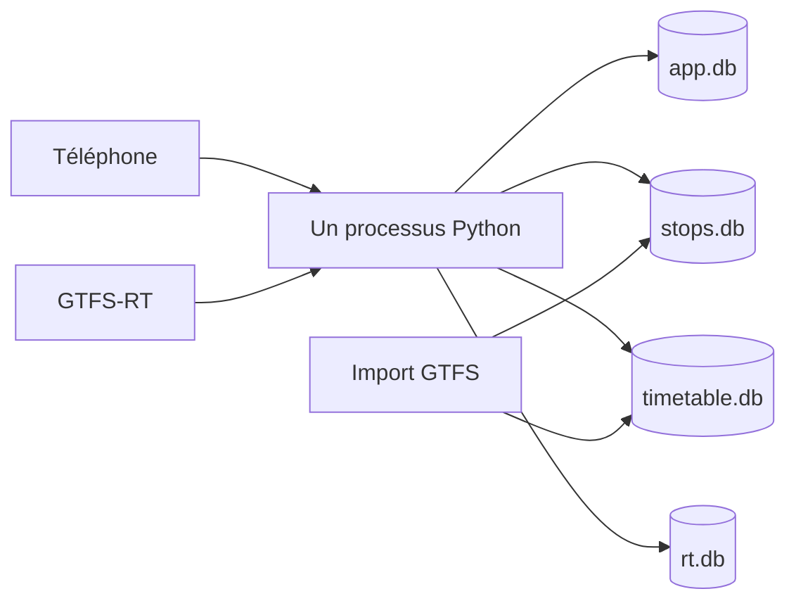

# ComptagesFer

Outil collaboratif pour compter la fréquentation des TER en France, puis rendre ces comptages publics, lisibles et réutilisables.

**Statut :** phases 0 à 5 livrées, septembre 2026. Phases 6, 7 et 8 commencées. Ce document est la source de vérité : quand le code et le plan divergent, c'est le plan qui a tort, et on le corrige dans le changement qui révèle l'écart.

**Source du besoin :** cahier des charges « ComptagesFer » (présentation de trois diapositives).

**Dépôt :** https://github.com/LordD9/ComptageFer — licence du code : GPL-3.0.

**Décision d'architecture :** un seul processus Python, deux fichiers SQLite, pages statiques servies par ce processus. Aucun service managé. Le déploiement, c'est un conteneur : `docker compose up`, un volume pour les bases. Pas de second mode d'installation.

---

## 1. Le problème

Les données officielles de fréquentation des trains régionaux sont souvent confidentielles, hétérogènes, ou trop pauvres pour comparer des lignes. Beaucoup d'études en ont pourtant besoin : potentiel d'une ligne, offre à mettre en face, comparaison entre territoires.

L'idée est simple. Des gens déjà dans le train — passionnés, associations d'usagers, voyageurs, agents — comptent les voyageurs pendant leur trajet et le saisissent dans un outil léger. En retour, l'outil montre ce qui a été collecté. D'abord brut. Agrégé seulement quand la matière est suffisante, et seulement avec une méthode visible.

Le périmètre visé à terme : toutes les lignes TER de France, autocars compris quand l'offre théorique existe.

Ce dépôt est un projet personnel. Il ne porte pas la marque d'un établissement public.

## 2. Ce que l'outil doit permettre

### Contribuer

Le cas d'usage est un téléphone, dans un train, souvent avec un réseau médiocre. La saisie part d'une origine et d'une destination. La carte vient après, pour lire les résultats.

1. J'ouvre l'application. Si je l'autorise, la position propose la gare la plus proche, puis elle est oubliée. Sinon je cherche mon origine.
2. Je donne ma destination.
3. L'outil liste les circulations qui desservent cette origine-destination, sur une plage de 4 heures centrée sur maintenant : les deux heures passées, les deux heures à venir. L'heure et l'état viennent du flux temps réel, pas de l'horaire théorique. Je sélectionne mon train. S'il n'y est pas, je signale une offre manquante. Je ne l'invente pas dans le référentiel.
4. Je passe au formulaire. Le retard, l'heure et la suppression ne se tapent pas.
   - **Comptage unique.** Une interstation (les deux arrêts qui l'encadrent), un effectif, et trois indicateurs approximatifs : part de gens debout, part de places assises restantes, écart de charge entre la partie la plus chargée et la moins chargée.
   - **Serpent de charge.** Je monte, je compte une fois les portes fermées, puis à chaque arrêt j'indique montées et descentes jusqu'à ma descente. Les indicateurs du mode unique sont optionnels sur chaque interstation. Compter sa propre descente est optionnel.
5. Pseudo, si je veux. Facultatif. Pas un compte.
6. En quittant, j'indique un pourcentage de fiabilité. Commentaire et modèle de véhicule seulement si j'ai quelque chose à ajouter.

À la sélection, l'outil fige l'état du train choisi, du précédent et du suivant sur la même origine-destination. C'est cette photo qui voyage avec le comptage. On ne relit pas le flux plus tard pour reconstituer le contexte : il ne le contient plus.

### Lire

1. Une carte, ou une recherche par nom de gare, origine, destination ou nom de ligne.
2. S'il n'y a rien : une invitation à compter, pas une page vide.
3. S'il y a peu de comptages : la liste, le type (unique ou serpent), les commentaires. Pas d'estimation déguisée en chiffre officiel.
4. S'il y en a assez : des estimations en voyageurs et en voyageurs.kilomètres à l'année, avec un découpage semaine / week-end, creux / pointe. Cette marche n'est pas la première. Elle exige une méthode écrite, parce qu'un échantillon de passionnés n'est pas un sondage.
5. Plus tard : comparer des lignes, agréger un lot de lignes, une agglomération ou une région, exporter des synthèses.

L'export des données brutes, lui, arrive tôt. C'est le retour dû aux gens qui comptent.

## 3. Principes

- **Simple à poser.** Un conteneur, une base fichier, pas de base managée. La commande est la même partout où Docker tourne.
- **Le téléphone dans le train est le client principal.** Grandes zones tactiles, peu d'étapes. On saisit le compte, pas le contexte que le flux connaît déjà.
- **Brut avant estimé.** Pas de chiffre annuel tant que la règle d'extrapolation n'est pas écrite et affichée à côté du chiffre. Une suppression du train précédent est un fait conservé, pas un effectif qu'on réécrit.
- **Anonyme par défaut.** Pas de compte pour contribuer. Un pseudo facultatif peut signer un comptage. Il n'identifie personne, et il n'ouvre aucun droit.
- **L'offre vient du GTFS, le contexte du temps réel, les comptages des gens.** On ne mélange pas les trois. Une circulation absente est un signalement, pas une ligne créée à la main.
- **Pas de trace GPS.** La position peut proposer l'arrêt le plus proche. Elle n'est pas enregistrée.
- **Les comptages partagés sont en Licence Ouverte 2.0.** Le code reste en GPL-3.0. Les deux licences ne se mélangent pas.
- **Pas de marque institutionnelle**, pour le moment. Le dépôt est personnel.
- **Un effectif saisi n'est pas une fréquentation officielle.** Chaque écran de résultat le dit.

## 4. Architecture


```mermaid
flowchart LR
  phone[Téléphone] --> app[Un processus Python]
  app --> appdb[(app.db)]
  app --> stopsdb[(stops.db)]
  app --> timedb[(timetable.db)]
  app --> rtdb[(rt.db)]
  feeds[GTFS-RT] --> app
  cron[Import GTFS] --> timedb
  cron --> stopsdb
```

Quatre bases, pas trois, et les noms ont changé depuis le cadrage :

- `app.db` garde les comptages et la photo du contexte au moment de la saisie. **Précieux**, jamais jeté.
- `stops.db` garde les noms de gares, tirés uniquement de `stops.txt`. Pas l'horaire. Jetable.
- `timetable.db` garde l'offre théorique. Jetable. *C'est le fichier que le plan appelait `gtfs.db`.*
- `rt.db` garde quelques heures de temps réel. Jetable.

Le plan initial prévoyait `gtfs.db` pour l'offre et `stops.db` pour les noms. À l'usage, l'offre et les noms sont deux fichiers distincts : l'import des noms est rapide et sert dès la recherche, alors que l'offre est lourde et n'a pas lieu d'être rechargée. D'où `stops.db` pour les noms, `timetable.db` pour l'offre.

Rien d'autre. Pas de Postgres, pas de Redis, pas de file de messages, pas de frontend à builder sur le serveur.

### Pourquoi ce choix

La contrainte est de déployer la même chose quel que soit l'hébergeur. Donc un artefact, pas une procédure par machine.

Le déploiement est Docker Compose. Une commande, un conteneur, un volume `data/`. Ça ne complique pas : c'est ce qui évite de documenter un virtualenv, une unité systemd et un PaaS en parallèle. Trois notices, c'est trois façons de se tromper. Une seule, testée, suffit.

Docker compliquerait les choses s'il embarquait une base à part, un Redis, un worker. Ici il n'embarque que le processus. SQLite est un fichier dans le volume. Oublier le volume est le seul piège, et le `compose.yaml` le monte par défaut.

L'hôte doit savoir lancer un conteneur. VPS, Raspberry Pi, Coolify, NAS, PaaS conteneur : même commande. Un mutualisé sans Docker n'est pas une cible. Un import GTFS et une carte n'y tiendraient pas de toute façon.

| Option écartée | Raison |
| --- | --- |
| Next.js + Postgres managé (Vercel, Supabase, Firebase) | Deux runtimes, base à part, lié à un hébergeur. |
| Docker + Postgres | Un second conteneur pour une charge qui tient dans un fichier. |
| Microservices | Pas assez de charge, pas assez d'équipes. |
| Application native | Un store de plus, deux codebases. Le web mobile suffit. |
| PHP + SQLite | Très portable sur mutualisé, mais le GTFS et les calculs seront en Python. Inutile de couper en deux. |
| PocketBase seul | Pratique pour du CRUD, gênant dès que le rapprochement GTFS devient le cœur du métier. |
| Notice systemd en plus de Docker | Une seconde procédure qu'on ne testera pas. |

La configuration tient dans l'environnement : chemin des bases, jeton d'admin le moment venu, URL publique. Pas de fichier de config propre à un hébergeur.

SQLite en mode WAL suffit. Les écritures sont rares (un comptage par voyage), les lectures dominent. On migrera le jour où ça ne suffit plus. Ce jour n'est pas le premier.

Un reverse proxy (Caddy, nginx) est optionnel. Il sert au HTTPS. L'application n'en a pas besoin pour fonctionner.

### Pile

- Python 3.12
- FastAPI, servi par uvicorn
- SQLite
- HTML, CSS, un peu de JavaScript. Pas de framework.
- Leaflet et des tuiles OpenStreetMap. Pas de clé d'API.
- Pas de Node en production. Si un bundler devient utile, il reste un outil de développement.

### Offre théorique

Source de la v1 : le GTFS national « Réseau SNCF TGV, Intercités et TER », sur [transport.data.gouv.fr](https://transport.data.gouv.fr/datasets/horaires-sncf).

- Fichier : <https://eu.ftp.opendatasoft.com/sncf/plandata/Export_OpenData_SNCF_GTFS_NewTripId.zip>
- Horaires théoriques SNCF Voyageurs (TER, Intercités, TGV) pour les jours à venir, en GTFS et en NeTEx. On prend le GTFS.
- La version consultée en septembre 2026 fait environ 4,4 Mo, 721 lignes, modes train, car et tramway. Elle n'a pas de `shapes.txt`.

### Temps réel

Le temps réel sert à ne pas faire saisir le contexte. Il ne sert pas à réécrire le comptage.

Sources, sur le même jeu SNCF :

- Trip Updates : <https://proxy.transport.data.gouv.fr/resource/sncf-gtfs-rt-trip-updates>
- Service Alerts : <https://proxy.transport.data.gouv.fr/resource/sncf-gtfs-rt-service-alerts>

Le flux Trip Updates est une photo des trains qui circulent dans les 60 prochaines minutes, rafraîchie toutes les 2 minutes. Il n'a pas d'historique. Un train déjà parti en sort. Une suppression d'il y a deux heures n'y est plus.

La liste vient du cache temps réel, pas de l'horaire théorique. Chaque train du flux porte déjà son heure absolue et ses arrêts. On garde ceux dont le départ tombe dans la fenêtre de 4 heures. Le flux vivant ne couvre que l'heure qui vient : le passé vient du cache, et l'heure au-delà n'apparaît que lorsqu'elle entre dans le flux. Le flux n'a pas le nom des gares. Une table de noms, tirée uniquement de `stops.txt`, sert à la recherche. Ce n'est pas l'horaire.

Le processus interroge le flux toutes les 2 minutes et garde 6 heures dans `rt.db`, puis efface.

À la sélection, on copie trois lignes dans `app.db` : le train choisi, le précédent, le suivant, sur la même origine-destination. Cette copie survit à l'effacement du cache. Si le flux ne sait pas, l'état est `inconnu`. On ne l'invente pas, et le comptage n'est pas bloqué.

Même origine-destination veut dire : le train immédiatement précédent et le train immédiatement suivant qui desservent les deux arrêts du voyageur. C'est l'unité utile pour un report de charge. Si aucun voisin ne dessert les deux arrêts, on prend le voisin sur la même ligne au départ de l'origine, et on le marque comme correspondance faible.

Si Trip Updates est vide, le même cycle essaie le SIRI ET Lite avant de déclarer l'état inconnu. Ce n'est pas un second service. Les deux flux ont la même fenêtre de 60 minutes.

Le poller tourne dans le processus déjà lancé par Compose. Pas de second conteneur.

On ne déduit pas un report de voyageurs d'une suppression. On conserve le fait. L'interprétation viendra avec une méthode, ou pas.

Conséquences :

- La carte v1 relie les arrêts ordonnés. Elle ne suit pas la voie réelle.
- Le GTFS national duplique souvent une gare en arrêt train et arrêt car. Le sélecteur doit montrer le mode.
- Les cars TER opérés par SNCF Voyageurs sont dans ce fichier. Les cars d'autorités régionales (liO, BreizhGo, Aléop, etc.) non. Même commande d'import, autres ZIP, plus tard.
- Certains TER ne sont plus opérés par SNCF Voyageurs. Ils ne sont pas dans ce fichier non plus.

L'import est fait par le processus lui-même, au démarrage, quand les bases manquent. C'est un choix de déploiement autant que de conception : la seule façon de lancer l'application est `docker compose up -d`, donc une installation qui exige une commande d'import séparée est une installation qui peut échouer à moitié. Le référentiel est donc réduit à une variable : le volume `data/` arrive vide, le conteneur remplit les bases, la page fonctionne.

`ensure_referential()` fait le travail, une fois :

- elle télécharge le ZIP national, une seule fois, à froid
- elle extrait `stops.txt`, `trips.txt`, `stop_times.txt` et `calendar_dates.txt`
- elle remplit `stops.db` si elle est absente ou vide, et `timetable.db` si elle est absente
- l'offre est écrite dans `timetable.importing` puis renommée, donc un import interrompu ne laisse pas une base à moitié construite
- si les deux bases sont déjà là, elle ne télécharge rien

**Conséquence à garder en tête :** rafraîchir un horaire périmé n'est pas une opération prévue. Il faut supprimer `timetable.db` et redémarrer le conteneur. La SNCF publie un jeu mensuel environ, donc une commande de rafraîchissement est à ajouter quand la question se posera vraiment, pas avant.

Les tests contournent ce chemin : `tests/test_browser.py` écrit sa propre base GTFS miniature, ce qui garde la suite rapide et sans réseau.

### Fichiers de déploiement

```text
data/            # volume, hors git
  app.db         # comptages + photo du contexte — précieux
  stops.db       # noms de gares — jetable
  timetable.db   # offre théorique — jetable
  rt.db          # cache temps réel, quelques heures — jetable
.env             # hors git, contient ADMIN_TOKEN
Dockerfile
compose.yaml     # déclare ADMIN_TOKEN, ne contient pas sa valeur
```

Celui qui lance le conteneur définit `ADMIN_TOKEN` dans `.env`, lu par Compose. Ce jeton est l'administration : masquer une saisie, rien de plus. Il n'est pas dans l'image, ni dans git. Pas de compte administrateur.

## 5. Modèle

Trois fichiers jetables pour l'offre et le temps réel, un fichier précieux pour les comptages. On peut jeter `stops.db`, `timetable.db` et `rt.db` sans toucher aux saisies.

### Offre (`timetable.db`, jetable)

Tables utiles : `stops`, `routes`, `trips`, `stop_times`, `calendar_dates`.

Index prévus : nom d'arrêt, `(stop_id, heure)`, `route_id`. On garde le mode (train, car, tram).

Les heures GTFS peuvent dépasser 24:00. La date de service n'est pas toujours la date civile. On stocke les deux, on n'invente pas de fuseau : l'offre française est en heure locale.

### Noms de gares (`stops.db`, jetable)

Une seule table, `stop`, tirée de `stops.txt` uniquement. Elle sert la recherche par nom et la gare la plus proche. Le GTFS national ne donne pas les coordonnées dans un fichier séparé : elles viennent du même `stops.txt`, quand elles y sont.

Le flux temps réel ne donne pas le nom des gares, et il travaille surtout en StopPoint là où la recherche renvoie un StopArea. D'où deux tables : celle-ci pour chercher, `timetable.db` pour l'horaire.

### Comptages (`app.db`, précieux)

**Une seule table, `saisie`.** Le cadrage prévoyait trois tables — session, observation, signalement — séparées. En pratique les trois sont arrivées d'un coup et toujours ensemble : une observation sans session n'a pas de sens, un signalement n'a pas d'observation. Séparer aurait introduit trois clés étrangères pour rien. Donc une table, et `kind` fait la discrimination : `count`, `serpent`, `missing`.

- `client_id` en clé primaire. C'est un UUID créé dans le navigateur avant l'envoi. Il rend l'envoi idempotent : un réessai après un tunnel ne crée pas un doublon. On le pose dès la première saisie, pas à la phase hors-ligne.
- `kind` : `count`, `serpent` ou `missing`
- origine et destination, qui ne sont pas forcément celles du train
- `trip_id`, la circulation confirmée, sinon rien
- `passengers`, l'effectif. En mode serpent c'est l'effectif portes fermées : c'est le nombre saisi, pas le total reconstruit. La reconstruction reste dans `legs`.
- `reliability`, entier de 0 à 100
- `pseudo`, facultatif, texte libre court. Pas un compte, pas un droit.
- `comment`, facultatif, texte libre court. C'est la partie qui explique un comptage atypique : train précédent supprimé, car de substitution, forte charge. Il est publié dans le CSV, donc lu par ceux qui réutilisent les données, et affiché dans l'admin.
- `standing`, `seats_free`, `imbalance`, optionnels
- `legs`, le profil du serpent, en JSON. La suite ordonnée des arrêts avec l'effectif de départ puis montées et descentes. Effectif suivant = effectif + montées − descentes.
- `trajet`, le trajet **complet** du train, en JSON, figé au moment du comptage. La suite ordonnée de tous ses arrêts, avec l'heure de départ de chacun. Un comptage ne parle que du tronçon où l'on a compté ; le train venait d'ailleurs et continuait ailleurs, et c'est cette charge-là qu'une estimation de fréquentation cherche à l'étape suivante. On fige parce que le GTFS est rechargé : une ligne peut changer de gares, et la saisie doit dire ce qu'elle a vue. Sans `trip_id` il n'y a rien à figer — deviner le train serait fabriquer de la donnée — et un « train signalé » n'en a pas non plus, puisque c'est un doute sur une ligne, pas une observation.
- `snapshot`, la photo du contexte, en JSON : le train choisi, le précédent, le suivant, leurs états, retards, sources et l'instant de la prise
- `created_at`, horodatage de réception

Les pourcentages sont des estimations de l'utilisateur. On ne déduit pas l'un de l'autre.

La photo du contexte est prise à la sélection du train, pas au moment de l'envoi. Elle est renvoyée au téléphone avec la liste, et renvoyée avec le comptage. Un envoi tardif, après un tunnel, ne relit pas le flux : l'état aurait changé, ou disparu. Elle contient, pour le train choisi et ses voisins :

- départ théorique à l'arrêt d'origine
- état : `programmé`, `à l'heure`, `retard`, `avance`, `supprimé`, `inconnu`
- retard en minutes, s'il est connu
- source : `tu`, `alerte`, `siri`, `aucune`
- instant de la prise
- correspondance `forte` (les deux arrêts) ou `faible` (même ligne, origine seulement)

On ne stocke pas de position GPS.

## 6. Hors périmètre pour l'instant

- Comptes, mots de passe, OAuth.
- Estimation annuelle de voyageurs et de voyageurs.kilomètres.
- Comparaison de lignes, agrégats région ou agglomération.
- Géométrie réelle des lignes.
- Archivage permanent de tout le flux national. Seuls le cache court et les photos liées à un comptage sont gardés.
- Application native, et PWA installable.
- Modération multi-utilisateurs. L'administration, c'est `ADMIN_TOKEN` dans l'environnement du conteneur.
- Édition du GTFS depuis l'interface.

## 7. Plan

Chaque phase se termine par quelque chose de déployable. On ne commence pas la suivante tant que la précédente n'est pas utilisable.

Le plan tâche par tâche, avec tests, s'écrit au début de chaque phase. Pas avant : le cadrage bougerait trop.

### Phase 0 — Cadrage

Ce document. Les questions de la section 8 sont tranchées. **Livrée.**

### Phase 1 — Squelette qui se déploie

Un processus qui démarre partout, avec une base vide et une page d'accueil.

Fichiers :

- `pyproject.toml`, paquet `comptagefer`
- `comptagefer/app.py` — `GET /` et `GET /health`
- création du schéma `app.db` au démarrage
- `Dockerfile`, `compose.yaml`, volume `./data`
- `.gitignore` pour `data/`, `.env`, `.venv/`
- `compose.yaml` déclare `ADMIN_TOKEN`, la valeur vient du `.env` local
- notice de déploiement dans le README : `docker compose up`, et le jeton d'admin à définir au lancement

Vérification : sur une machine neuve, `docker compose up` répond sur le port annoncé, et `data/app.db` survit à un redémarrage. **Livrée.**

### Phase 2 — Import GTFS

Proposer une circulation à partir d'un arrêt et d'une heure.

- import du ZIP national, au démarrage et seulement si les bases manquent
- `timetable.db` en lecture seule côté API
- `GET /api/stops?q=`
- `GET /api/trips?stop_id=&at=` — circulations autour de l'heure, avant et après

Vérification : une grande gare à une heure de pointe renvoie des TER, et distingue train et car quand les deux existent. **Livrée**, avec le contournement décrit en section 4 : pas de commande séparée.

### Phase 3 — Saisie : origine, destination, train, compte

Le parcours téléphone. On choisit un train dans une liste, on ne le décrit pas.

- poller dans le même processus : Trip Updates et alertes toutes les 2 minutes, cache 6 heures dans `rt.db`
- repli SIRI ET Lite si Trip Updates est vide
- `GET /api/trips?from=&to=&at=` : circulations du cache temps réel qui desservent les deux arrêts entre `at - 2 h` et `at + 2 h`
- à la sélection, photo du train choisi, du précédent et du suivant
- formulaire : interstation, effectif, indicateurs, fiabilité, pseudo et commentaire facultatifs
- `POST /api/sessions` enregistre le comptage, le pseudo et le commentaire s'il y en a, et la photo reçue, sans relire le flux
- idempotent sur `client_id`
- signalement d'offre manquante

Vérification : la liste d'une origine-destination couvre bien 4 heures. Un comptage relu après effacement de `rt.db` a encore ses trois circulations et leurs états. Renvoyer le même `client_id` ne crée pas une seconde session. Couper le flux ne bloque pas la saisie. **Livrée.**

### Phase 4 — Réseau coupé

Priorité avant la carte. Dans un TER, le réseau lâche. Un comptage perdu ne sert à personne.

- si l'envoi échoue, le payload reste dans le navigateur, photo comprise
- réessai au retour du réseau, même `client_id`
- le choix du train se fait quand le réseau passe. Pas de GTFS hors ligne en v1.

Vérification : mode avion après la sélection, saisie, retour réseau, une seule session créée, avec la photo prise avant le tunnel. **Livrée.** Une nuance : le test coupe le réseau au niveau du navigateur, pas au niveau radio.

### Phase 5 — Serpent de charge

Le second mode, pas avant que le premier survive à un tunnel.

- saisie arrêt par arrêt, le profil est conservé dans la file hors ligne comme le reste
- même file d'attente que la phase 4
- reconstruction : effectif suivant = effectif + montées − descentes
- indicateurs de charge optionnels

Vérification : une session de trois arrêts donne un profil cohérent avec cette égalité. **Livrée**, y compris *reprendre une saisie de serpent en quittant la page et en revenant plus tard*. La file hors ligne ne le couvrait pas : elle ne transporte que ce qui doit partir vers le serveur, pas une saisie en cours. Le serpent est donc écrit dans le `localStorage` à chaque « Suivant », et proposé au chargement, avec un bouton pour l'abandonner. Un serpent vide ne propose rien, et un serpent parti n'est plus proposé.

### Phase 6 — Lecture, carte, export

La carte sert à voir les résultats, pas à saisir.

- liste des comptages, pseudo affiché s'il a été donné — **fait**
- `GET /api/export.csv`, licence indiquée : Licence Ouverte 2.0 — **fait**
- mention visible : ce n'est pas une fréquentation officielle — **fait**
- carte Leaflet : arrêts comptés, tracés le long de la voie ferrée réelle — **fait**, c'est `/carte`
  - le tracé est routé sur le réseau ferré national (Cerema, Licence Etalab 2.0),
    pas interpolé entre deux arrêts ; un Paris–Marseille suit les voies
  - quand le réseau ne relie pas deux arrêts, le segment reste droit, et le
    bas de page dit combien de tracés sont dans ce cas
  - les marqueurs restent sur les gares : le tracé ne les déplace pas
  - un serpent est dessiné arrêt par arrêt, pas comme un couple origine-destination
  - un arrêt enfant sans position prend celle de sa gare
  - moins de deux arrêts plaçables, la saisie n'est pas dessinée et la page le dit
  - fond de plan : tuiles raster OpenStreetMap, aucune clé d'API. La politique d'usage d'OSM est le
    vrai plafond ; un fournisseur de tuiles se change en une constante
  - Leaflet vient d'un CDN : sans réseau, la page le dit et garde la liste des tracés
- recherche par nom — **fait**, c'est `/rechercher`, un seul champ pour une gare ou une ligne
- page ligne : liste brute, ou invitation à contribuer s'il n'y a rien — **fait**, c'est `/ligne`

#### La lecture sur un écran large

Sept pages recopient chacune leur mise en page, et sept fois le même `max-width: 32rem`. Le mobile y est bon — le formulaire se fait au pouce, dans un train — mais `/comptages` sur un écran large, c'était une colonne de 512 px centrée, avec la moitié de la hauteur en vide.

Le chrome est donc écrit une fois, dans `comptagefer/affichage.py` : en-tête, navigation, pied, et une media query qui ouvre la lecture à 72 rem au-delà de 48 rem. Trois décisions valent d'être écrites ici, parce qu'elles ne se devinent pas dans le CSS :

- **Une page, deux lectures.** La liste existe en cartes et en tableau, dans le même HTML : les cartes sur un téléphone, le tableau sur grand écran, l'un retiré du rendu quand l'autre s'affiche. Les faire coexister ferait lire chaque relevé deux fois. Le tableau ajoute ce qui manquait : date, fiabilité, tri par en-tête. Le tri est un paramètre d'URL (`?tri=&sens=`) et non un état navigateur : une liste triée se partage et se teste, et il n'y a pas de JavaScript dans une page dont le JavaScript n'est jamais exécuté par la suite de tests.
- **Un relevé sans valeur sort en dernier, dans les deux sens.** Un « train signalé » n'a pas d'effectif : trié décroissant, il remonterait en tête et se lirait comme le relevé le plus chargé. `reverse=True` portant sur un « la valeur manque » booléen fait exactement ça, donc ils sont retirés, triés, puis remis à la fin.
- **Ce qui est dans la base est sur la page.** `created_at`, `reliability`, `comment`, `standing`, `seats_free`, `imbalance` sortaient dans le CSV sans qu'un lecteur du site puisse les voir. La date est en heure de Paris, pas en ISO UTC.

La carte prend la hauteur de l'écran sur grand écran, la liste des tracés passe à côté. La page ligne lit ses arrêts et ses comptages côte à côte. C'est une media query, pas une refonte : rien n'a été ajouté au-delà de 48 rem, et le téléphone ne change pas.

#### Filtrer, et comparer par paire de gares

Un écran large sert d'abord à comparer, donc `comptagefer/filtres.py` porte les trois filtres de `/comptages` — `?depuis=&jusqu=&mode=&ligne=` — plus la vue `?vue=paire`. Cinq décisions ne se devinent pas dans le code :

- **Les filtres sont dans l'URL, et tous les liens de la page les conservent.** C'est le prolongement du tri : une liste filtrée se partage et se teste. Le corollaire est la faute que pytest ne voit pas — un lien de tri qui reconstruit son URL perd le `ligne=` courant, et le lecteur voit les relevés qu'il vient d'exclure. Toutes les URL passent donc par une seule fabrique, qui prend l'état courant et le modifie au lieu de le reconstruire.
- **Un filtre illisible est écarté *et nommé*.** L'écarter en silence est pire que ne pas l'écarter : le lecteur qui filtre par « laisse-passer » verrait la liste entière et croirait que son filtre n'a rien donné. La page affiche donc la raison de l'écart dans le formulaire, et les chips disent ce qui est *appliqué*.
- **`?ligne=` passe par le `trip_id`**, comme `/ligne`, et pour la même raison : deux lignes se partagent souvent le corridor. Le champ est un texte libre et non une liste déroulante, parce que le GTFS national attribue le même « C13 » à six lignes — une liste de noms courts ouvrirait une page au hasard.
- **La vue par paire est un paramètre, pas une page.** Elle répond à une question qu'aucune page ne posait — « la charge typique sur Lyon–Chambéry » — en HTML, sans JavaScript, pour la même raison que le tri. Son tri par défaut est le **nombre de relevés décroissant** : un corridor en tête avec 40 relevés est mieux documenté qu'un corridor en tête avec 2. Le mettre en tête par effectif moyen répondrait à une autre question, « le plus chargé », qui mélange ce que la base sait et ce que la circulation fait. Un train signalé compte dans `releves` et pas dans la moyenne : le compter comme 0 ferait passer « non mesuré » pour « vide ».
- **La pagination est mesurée, pas anticipée.** À 6 000 relevés, `/comptages` rendait 2,38 Mo de HTML en 227 ms. La liste est coupée après le tri — une page affichée avant tri se reconnaît à rien — à 200 par page, et la page dit « 200 sur 5 000 » pour que la tranche ne se prenne pas pour le jeu entier. Le total est compté en SQL, pas déduit de la liste rendue. Sous 200 relevés, aucun sélecteur de page : un bouton « page 1 » unique se lit comme cassé.

Le verrou que le plan posait tient : un filtre qui vide la liste dit ce qu'il a filtré et propose de l'enlever. « Enlever le filtre » et « Tout enlever » retirent tout — une page vide ne dit pas *quel* filtre a échoué, donc il n'y a pas « celui-ci ».

Deux décisions ne sont pas de l'implémentation mais de la suite : le tri reste en Python, pas dans la requête, pour que `_list_saisies` — qui rend aussi le CSV publié — reste hors de tout paramètre d'affichage ; et la vue par paire est coupée au même seuil que la liste, pour la même raison. J'avais écrit le contraire, en arguant qu'il y a au plus autant de paires que de relevés et que la vue serait donc plus légère : **la mesure refute cet argument**. Sur 6 000 relevés répartis sur 90 × 37 gares, la vue par paire rendait 0,60 Mo et 148 ms — six fois le poids d'une page de liste. Une justification écrite sans mesure coûte une page à 0,6 Mo le jour où la base grossit.

Deux faits de la source ont décidé la forme de la page ligne, et il vaut mieux les écrire ici qu'un jour dans un ticket :

- **Les noms de ligne ne sont pas uniques.** Le GTFS national compte 725 lignes pour 423 noms courts : `C13` désigne six lignes différentes, `INCONNU` cinquante-trois. Une URL construite sur le nom court ouvrirait donc une page au hasard. Tout ce qui identifie une ligne passe par le `route_id`, et le titre affiché porte toujours le nom long, parce que « C13 » ne veut rien dire pour quelqu'un qui ne connaît pas la numérotation SNCF.
- Le réimport se fait une fois : une base installée avant les pages ligne est détectée au démarrage suivant et réimportée, parce qu'une recherche de ligne muette serait pire qu'une attente. Le `routes.txt` ajoute environ 20 Mo à `timetable.db`, qui pèse déjà 200 Mo.
- **Le rattachement d'un comptage à une ligne passe par le `trip_id`**, le seul lien écrit au moment du comptage. Une paire origine-destination ne suffirait pas : deux lignes se partagent souvent le même corridor. Un « train signalé », lui, n'a pas de trip et n'apparaît sur aucune page ligne — on ne lui invente pas de ligne.

#### Le tracé suit la voie, et trois mesures ont décidé comment

`reseau.py` route un segment de saisie le long des voies SNCF. Le GeoJSON brut
fait 12 Mo ; il ne peut pas être lu à chaque requête, et le simplifier assez
pour entrer dans l'image coûtait la moitié des gares. Trois chiffres ont
tranché, et ils sont reproductibles avec `tools/build_reseau.py` :

- **Simplifier casse l'accrochage.** Douglas-Peucker à 20 m fait tomber
  l'accrochage des gares de 95 % à 75 %, puis à 65 % sur le graphe contracté.
  Il efface les points des faisceaux, où la voie se sépare en quelques rails
  écartés de quelques mètres, et une gare s'y retrouve à plus de 500 m de
  toute polyligne conservée. La géométrie est donc **conservée entière**, et
  c'est le format qui paie le poids.
- **C'est l'encodage, pas la simplification, qui fait le fichier.** Stocker
  chaque point par son écart au précédent fait passer le fichier de 4,80 à
  1,03 Mo compressés, à géométrie identique. Les deux valent 320 218 points ;
  seule la seconde se simplifie sans rien perdre.
- **Simplifier avant de contracter casse la topologie.** Dans cet ordre-là, le
  réseau se morce en 524 composantes connexes au lieu de 73, et presque aucun
  trajet ne reste routable. La contraction vient donc en premier, toujours.

Le contrat qui en découle : un trajet impossible rend `None`, jamais une
polyligne inventée. C'est ce `None` qui garde le segment droit et qui fait
que le bas de page peut annoncer le nombre de tracés concernés. Une carte qui
dessinerait un chemin plausible entre deux gares non reliées serait pire
qu'une carte honnête.

Reste une limite, mesurée et assumée : **85 % des gares s'accrochent** au
réseau livré (médiane à 38 m, aucune au-delà de 500 m). Les 15 % restantes
sont des gares dont la voie n'est pas dans le jeu SNCF — faisceaux couverts,
tunnels de gare, lignes récentes. On pourrait monter la borne et les
rattraper, mais une gare accrochée à un kilomètre de sa voie verrait son
tracé partir du mauvais côté d'un pont : la limite est écrite dans le bas de
la page plutôt que masquée. Elle vaut aussi pour les voies visées par le
sous-traitement ou les cars, qui ne suivent pas une voie.

### Phase 8 — Publication automatique

Les comptages publiés à la main ne le sont plus tous les jours. L'export part
tout seul, chaque nuit, sans que l'hébergeur ait une tâche cron à maintenir.

- export du CSV vers data.gouv.fr chaque nuit à minuit, heure de Paris — **fait**
- publication à la demande depuis `/admin`, pour vérifier la clé sans attendre
  minuit — **fait**, c'est `/admin/publier`
- état de la dernière tentative lisible sans entrer dans le conteneur, sans la
  clé — **fait**, c'est `GET /api/publish`
- aucun envoi si le CSV n'a que son en-tête : une base vide ne remplace pas la
  ressource du jour — **fait**

Trois faits ont décidé la forme, et ils valent mieux ici qu'un jour dans un
ticket :

- **La publication est un fil du processus, pas un service du compose.** Le
  plan interdit un second mode d'installation ; un service `cron`, une base et
  une file pour envoyer un fichier par jour seraient trois choses de plus à
  surveiller. Un `threading.Thread` avec un événement d'arrêt suffit, et il
  meurt avec le serveur, donc un redémarrage du conteneur ne laisse pas de
  publication orpheline.
- **La première publication crée une ressource, les suivantes la remplacent.**
  L'identifiant est mémorisé dans `data/publish.json`. Sans cela, un export par
  nuit laisserait un jeu de données de 365 ressources, et le lecteur n'aurait
  plus à savoir laquelle est la bonne. `DATAGOUV_RESOURCE_ID` permet de
  reprendre une ressource créée à la main, mais n'est pas nécessaire.
- **L'application ne crée pas le jeu de données.** Elle ne sait pas choisir un
  titre, une organisation, une licence, et le faire à sa place produirait un
  jeu de données mal décrit, qu'il serait plus dur de corriger qu'à créer. La
  clé et l'identifiant du jeu viennent donc du `.env`, et sans eux la
  publication est inactive : c'est un déploiement normal, pas une erreur.

Le CSV publié et celui de `/api/export.csv` sortent de la même fonction, dans
`comptagefer.publish`. Une publication qui dupliquerait la requête SQL
divergerait de ce que l'utilisateur télécharge, et personne ne le verrait avant
des mois.

Ce que la publication automatique ne fait pas, et qui reste à faire : la
checksum de la ressource, la page de catalogue, et l'historique — data.gouv.fr
garde les versions, mais rien ici ne les expose.

### Phase 7 — Qualité minimale

- `ADMIN_TOKEN`, lu depuis l'environnement du conteneur, comparaison en temps constant, valeur absente du dépôt — **fait**
- refus : effectif négatif, fiabilité hors 0–100 — **fait**
- page « méthode » : ce que les chiffres sont, ce qu'ils ne sont pas, et la licence des exports — **fait**, c'est `/methode`
- effectif au-dessus d'un seuil : signalé, pas bloqué — **fait**, seuil unique à 1 200

Le seuil est unique et non calibré par type de train, parce qu'aucune source ne donne la capacité du matériel : le GTFS national n'a aucun fichier de matériel, et le flux GTFS-RT ne publie pas cette information. Le seuil attrape donc une erreur de frappe, pas un train trop plein. Le message affiché ne prétend donc plus qu'un train français contient tant de personnes : il invite seulement à vérifier le chiffre. Un plafond par type de train resterait à faire si une source de capacité apparaît un jour, et il faudra alors mesurer plutôt que deviner.

Un test navigateur accompany ces phases depuis la PR 15 : le formulaire est du JavaScript écrit à la main dans une chaîne Python, et sans Chromium la suite passe au vert sur une page morte. Le workflow `Tests` le joue sur chaque PR.

### Phase 8 — La lecture, en trois vagues

La phase 7 a rendu l'outil correct. Celle-ci le rend lisible, en trois vagues
dans une seule PR (#40), parce qu'elles se servent l'une l'autre : on ne peut
pas comparer des corridors sans pouvoir d'abord les choisir.

**Vague 1 — la lecture s'ouvre sur un écran large.** Carte à côté de la liste
sur grand écran, page ligne à côté de ses arrêts. Une media query, pas une
refonte : rien au-delà de 48 rem, le téléphone ne change pas. **Livrée** (`84e79a0`).

**Vague 2 — filtrer, et comparer.** `?depuis=&jusqu=&mode=&ligne=` filtrent la
liste en une requête SQL ; `?vue=paire` regroupe les mêmes relevés par
origine-destination ; `?page=` découpe. La pagination a été **mesurée** : à
6 000 relevés la page rendait 2,38 Mo, coupée à 200 elle rend 89 ko. **Livrée**
(`b54b64f`, `1edbe0f`).

**Vague 3 — la liste et la carte se suivent, et la charge se dessine.**
Synchronisation liste/carte et profil de charge en SVG, sans changement
d'interface. **Livrée**.

Trois décisions, prises pendant la construction et non avant :

- **Le survol allume, le clic sélectionne.** Le survol est réversible et
  gratuit ; le clic déplace la carte et ouvre la courbe, ce qu'un survol
  ferait dix fois en descendant la liste. Le clavier a les deux : `focus`
  allume comme `mouseenter`, `Entrée` sélectionne comme le clic.
- **Un comptage unique a aussi une courbe.** Il porte sur tout son
  origine-destination, donc sa charge est constante entre les deux gares :
  deux points de même valeur. Ce n'est pas une interpolation, c'est ce que
  l'observation veut dire. Le graphe a donc le même sens pour les deux
  modes, au lieu d'être un cas particulier à côté.
- **Un train signalé n'a ni courbe ni bouton.** Un bouton qui n'ouvre rien
  est une promesse que la page ne tient pas ; la ligne reste du texte.

Une limite, dite : un serpent dont la dernière descente n'est pas relevée —
le voyageur ne compte pas sa propre sortie — a une courbe qui s'arrête à
l'avant-dernière gare, et la légende nomme l'arrêt où le compte s'arrête.
Prolonger la courbe jusqu'à la dernière gare dessinerait un palier, « rien
ne s'est passé », alors qu'on vient précisément de dire qu'on n'en sait rien.
De même, une gare sans coordonnées est parcourue et comptée, mais n'a pas de
place sur le graphique : ses montées et descentes entrent dans le calcul de
la charge, et elle ne reçoit pas de point. Sans cette règle, la valeur de
l'arrêt suivant se lirait à la mauvaise gare.

La courbe est **tracée par le script au clic**, pas écrite dans le HTML. Elle
l'a été d'abord écrite par le serveur, en Python, pour que pytest la relise :
c'était le bon réflexe et la mauvaise mesure. À 30 relevés, les SVG faisaient
**43 % de la page** — 27 ko pour un graphique qu'aucun lecteur ne voit avant
d'en ouvrir un. Les données étaient déjà là (`charge`, `noms_bruts` dans le
`<script>`) : le serveur ne les économisait pas, il les dupliquait. La page
est passée de 62,6 ko à **40,1 ko**, soit 36 % de moins.

Ce que ça coûte, et qui est réel : pytest ne voit plus la géométrie. Elle est
donc vérifiée dans un vrai Chromium, sur le DOM — l'axe part de zéro, le
plafond est arrondi au pas de 10, le maximum est nommé avec sa gare, la
courbe s'arrête où le compte s'arrête. C'est un test plus lent et moins fin
qu'un test de fonction, et c'est le bon échange quand la fonction en question
n'est visible qu'après un clic.

Un défaut que ce passage a révélé, et qui existait déjà : un nom de gare
contenant `</script>` **fermait la balise** et tuait le script au chargement.
`json.dumps` n'échappe pas `<`, et le `noms_bruts` rendait le cas possible.
Le `</` est maintenant échappé en `<\/` à la frontière du JSON. Sans
Chromium, ce défaut serait resté invisible : pytest ne charge pas de JavaScript.

Le champ « ligne » est un texte libre, pas une liste déroulante : le GTFS
national attribue le même « C13 » à six lignes, donc une liste de noms courts
ouvrirait une page au hasard. Il prend le `route_id`.

Deux choses que les vagues 1 et 2 ont apprises et qui ne se devinent pas :

- **La feuille de style n'est jamais exécutée par pytest.** La vue par paire
  portait la classe `tableau`, retirée sous 48 rem : la page répondait 200 et les
  tests de contenu passaient, sur un téléphone il n'y avait rien. Même classe
  de défaut que la vague 1. D'où les tests Chromium, désormais la règle pour
  toute vue.
- **Un tableau qui se dit vide doit le dire.** Une liste vide ne s'annonce pas,
  et le décompte d'une page doit nommer son ensemble : « 200 sur 6 000 », jamais
  « 200 ». C'est la faute que la pagination de la vague 2 a corrigée deux fois,
  sur les deux vues.

Une limite, dite : le filtre ligne a bien sa clause `trip_id IN (...)`, mais
sans `timetable.db` dans la suite pytest elle n'est pas vérifiée bout en bout. La
page `/ligne`, qui utilise la même lecture, l'est. C'est le prochain chantier de
couverture.

### Ensuite, dans cet ordre

1. Géométries de lignes, si les segments droits ne suffisent plus. Jointure OSM, ou GTFS régionaux qui ont un `shapes.txt`.
2. Autres GTFS : cars d'AOM, TER non SNCF. Leur temps réel viendra avec, sur le même poller, seulement s'il existe un flux.
3. Méthode d'estimation annuelle, écrite avant d'être codée. Jours types, biais de qui compte, seuil minimal de comptages, voyageurs.kilomètres. Le chiffre affiche toujours son dénominateur. Une suppression conservée ne devient pas, à elle seule, un report chiffré.
4. Comparaison de lignes et agrégats géographiques.
5. Comptes optionnels, seulement s'il faut un historique fiable ou une modération qui ne tient pas dans un jeton.

## 8. Décisions

1. Fermée. La file d'attente hors ligne passe avant la carte. La carte sert à lire, pas à saisir.
2. Fermée. Pseudo facultatif. Pas de compte.
3. Fermée. Pas de marque institutionnelle, pour le moment.
4. Fermée. La v1 s'arrête au GTFS et au GTFS-RT nationaux SNCF. Cars TER SNCF inclus, cars d'AOM et opérateurs non SNCF exclus.
5. Fermée. Licence Ouverte 2.0 pour les comptages partagés. GPL-3.0 pour le code.
6. Fermée. L'hébergeur est celui qui lance le conteneur. Il définit `ADMIN_TOKEN` à côté de Compose, et administre avec ce jeton.
7. Fermée. On choisit son train dans une liste de 4 heures centrée sur maintenant, annotée par le temps réel. À la sélection, on fige ce train, le précédent et le suivant.

## 9. Ce qui n'est pas une promesse

Un effectif saisi par un voyageur n'est pas une fréquentation officielle. Les estimations annuelles, le jour où elles existeront, afficheront le nombre de comptages sous-jacents et la règle utilisée. Pas de chiffre sans dénominateur.
